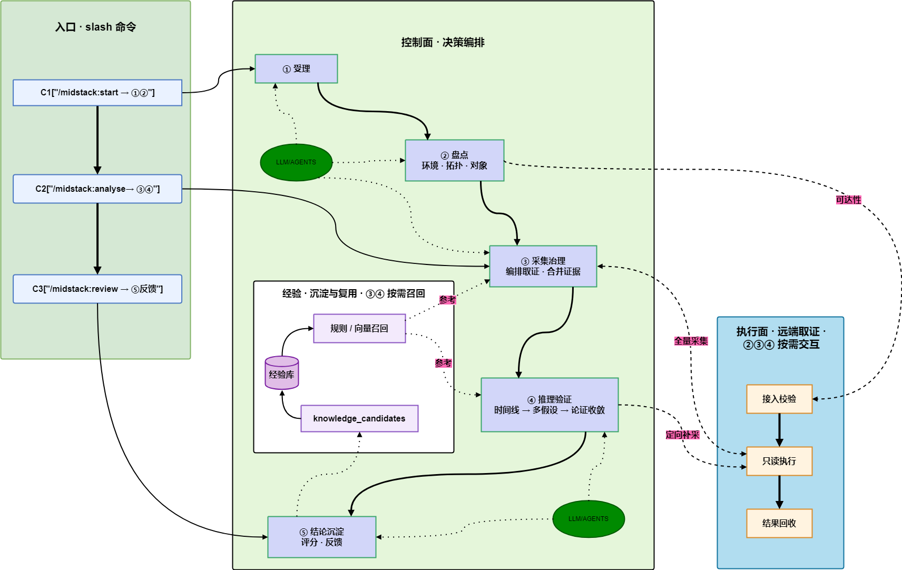

# Midstack Triage

[中文](README.md) · **English**

Turn production middleware troubleshooting know-how into installable, executable, and continuously improvable agent plugin capabilities.

Midstack targets PaaS middleware production incidents. It is not another monitoring stack, and it does not perform production changes by default. Instead, it converges “after a customer report arrives, how to confirm the environment, collect evidence, reason, and produce a reviewable conclusion” into a stable runtime and knowledge system.

## Why this project

High cost in production triage usually does not come from a lack of command execution ability. It comes from gaps that have long lacked productized support:

- Initial customer reports are often incomplete and inconsistent; symptoms, affected objects, and blast radius are mixed in one narrative
- Evidence collection is scattered across chat logs, ad-hoc scripts, personal experience, and on-the-spot judgment, with little unified orchestration
- Similar incidents are debugged from scratch each time, with little structured evidence chain to reuse
- Agents can generate analysis text, but without trustworthy evidence inputs, conclusions are hard to verify and easy to drift

Midstack fills that gap: from alert or incident intake to a handoff-ready, postmortem-friendly, and further-verifiable diagnosis.

## How it works

Midstack exposes three primary slash commands:

- `/midstack:start` — accept the raw lead, confirm environment IPs and remote access, create an incident, return `ready` or `blocked`
- `/midstack:analyse` — collect evidence, reason, and verify; analyzes the current incident by default and outputs results and a report
- `/midstack:review` — auto-generate five-dimension scoring, improvement suggestions, and risk notes from the latest analysis for continuous improvement

The runtime splits into two planes:

- **Control plane** — orchestrates the five-phase triage flow, manages state, drives Phase 4 reasoning and Phase 5 conclusion synthesis
- **Execution plane** — remote access, read-only script execution, evidence collection, and result return



Knowledge is fed back through `knowledge_candidates`; rule retrieval or a vector store can be added later, but that is not a first-version prerequisite.

For the architecture diagram, Phase 4 detail view, and legend, see [Architecture overview](docs/concepts/architecture-overview.md). For overall design, see [Architecture](docs/concepts/architecture.md).

## Five-phase triage flow

| Phase | Name | Role |
| --- | --- | --- |
| 1 | Intake & kickoff | Persist the raw lead and create the incident record |
| 2 | Environment confirmation & inventory | Confirm target environment, deployed objects, and triage scope |
| 3 | Signal collection & governance | Run read-only collection; align time, correlate objects, denoise, and summarize |
| 4 | Reasoning & deep verification | Multi-hypothesis reasoning, verification actions, conclusion convergence |
| 5 | Conclusion synthesis & knowledge capture | Report, recommendations, and knowledge candidates |

See [docs/concepts/triage-workflow.md](docs/concepts/triage-workflow.md) for the full workflow narrative.

## Quick start

Run the commands below from the `midstack-triage` repository root unless noted otherwise.

### Install into a Claude sandbox

```bash
python3 plugins/claude/plugin-install.py install --workspace /path/to/sandbox
python3 plugins/claude/plugin-install.py check --workspace /path/to/sandbox
```

This flow targets a sandbox. By default it clears the target workspace’s Claude project history. To keep history, see [plugins/claude/README.md](plugins/claude/README.md) and use `--keep-project-state`.

### Install into a Cursor workspace

```bash
python3 plugins/cursor/plugin-install.py --upgrade --workspace-init /path/to/workspace
python3 plugins/cursor/plugin-install.py --check-workspace /path/to/workspace
```

After install or upgrade, **reload Cursor** (Reload Window). Otherwise an already-open workspace may not pick up new slash-command projections.

The Cursor adapter installs a workspace-local runtime under `.cursor/midstack-triage-runtime/`; installed workspaces do not need to call back into this repository checkout.

### Run in an installed workspace

After installation, open an Agent session in the **workspace where the plugin is installed**.

Describe the incident in natural language; environment address, credentials, and the customer’s original wording can all go in one message:

```text
/midstack:start MongoDB replica set node unhealthy on 192.168.1.10, credentials root/example, customer reports query timeouts
/midstack:analyse
```

Recommended order:

1. **`/midstack:start`** — intake the lead and confirm the environment; continue on `ready`, or follow `blocked` guidance and re-run
2. **`/midstack:analyse`** — collect evidence, complete analysis, and generate a report
3. **`/midstack:review`** (optional) — quality assessment of the analysis run

These commands are only available inside an installed workspace. Examples assume test environments. `start` writes credentials into local incident config for later `analyse` runs; use temporary credentials or a future secret-reference mechanism in production.

## Current status

| Area | Status | Notes |
| --- | --- | --- |
| MongoDB | Active MVP | `start -> analyse` main path works; `review` for quality feedback; first batch of Phase 3 read-only collection scripts |
| Claude Code plugin | Available | Bundled runtime packaging, install, self-check, and sandbox tests; no second checkout inside the sandbox |
| Cursor adapter | Available | Workspace-local runtime, command/rule projection, sandbox smoke tests, and installed dependency checks |
| Pulsar | Skeleton | Structure and samples in place; analysis path not complete |

**Validated so far:**

- Phase 4 multi-track reasoning implementation lives in `src/phases/phase4/multitrack/`
- MongoDB fixture replay and local scoring pipeline for analyse regression
- Analyse output includes structured reports and knowledge-capture candidates

Full implementation checklist: [docs/project/implementation-status.md](docs/project/implementation-status.md).

## Repository layout

```text
midstack-triage/
├── docs/                         Concepts, specs, project status, proposals
├── src/
│   ├── commands/                 Slash commands and orchestration entrypoints
│   ├── phases/                   Five-phase control plane
│   ├── execution/                Execution plane
│   └── shared/                   Cross-phase shared capabilities
├── core/                         Models, templates, taxonomies, shared diagnostics
├── domains/
│   ├── mongodb/                  MongoDB-specific assets
│   └── pulsar/                   Pulsar domain samples
├── scenarios/                    Cross-middleware standard scenario definitions
├── interfaces/                   Cross-adapter interface contracts and examples
├── plugins/
│   ├── claude/                   Claude Code plugin and bundled runtime
│   └── cursor/                   Cursor projection adapter
├── tools/                        Validation, replay, generation, engineering tools
└── tests/                        Integration tests, fixtures, golden paths
```

## Documentation

Most detailed documentation is in Chinese. Entry points:

- [docs/README.md](docs/README.md) — documentation map and authority layers
- [docs/concepts/architecture-overview.md](docs/concepts/architecture-overview.md) — architecture diagram and Phase 4 detail view
- [docs/concepts/triage-workflow.md](docs/concepts/triage-workflow.md) — five-phase workflow
- [docs/specs/plugin-runtime.spec.md](docs/specs/plugin-runtime.spec.md) — plugin runtime contract
- [docs/project/implementation-status.md](docs/project/implementation-status.md) — implementation progress
- [docs/project/testing-and-install-gates.md](docs/project/testing-and-install-gates.md) — testing, install, and sandbox gates

Plugin READMEs ([Claude](plugins/claude/README.md), [Cursor](plugins/cursor/README.md)) are in English.

## Design boundaries

- Not a monitoring or alerting system
- Not a middleware control plane
- No high-risk production changes by default
- Not tied to a single agent platform

## Local validation

```bash
python3 tools/validators/validate-repo.py
python3 tools/replay/mongodb-replay.py --run-analyse
python3 tools/replay/mongodb-score.py --run-analyse --min-level medium
```

For adapter install self-checks and `/midstack:validate`, see [plugins/claude/README.md](plugins/claude/README.md) and [plugins/cursor/README.md](plugins/cursor/README.md).

## License

This project is licensed under the [Apache License 2.0](LICENSE).
See [NOTICE](NOTICE) for provenance and redistribution notes.
