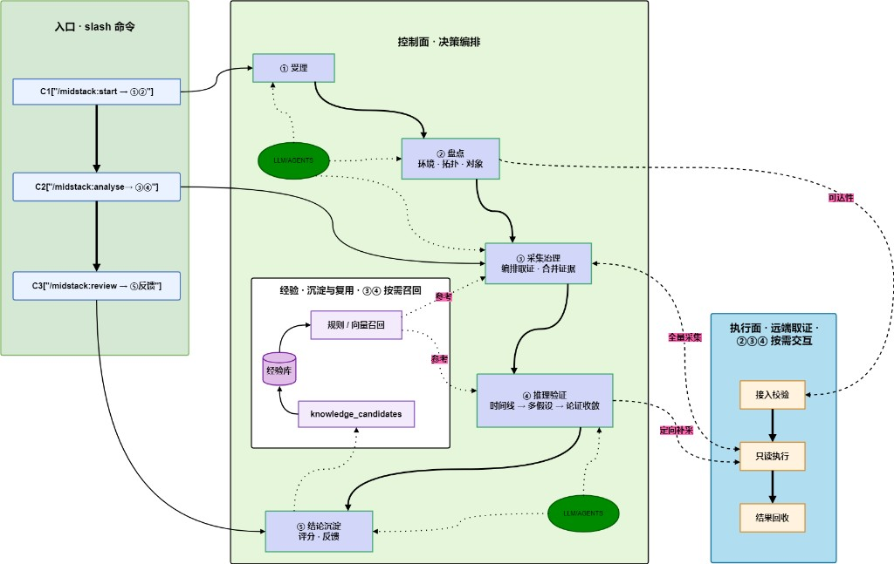
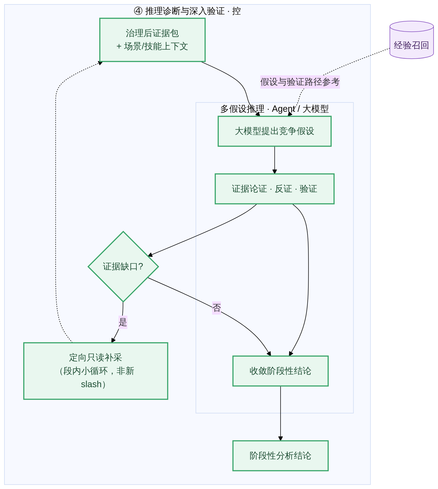

# Midstack 架构图

> Midstack 用 `/midstack:start` / `/midstack:analyse` / `/midstack:review` 把 5 段排障流程串起来；控制面（含 LLM/Agents）负责决策编排与推理，执行面负责远端取证；经验通过 `knowledge_candidates` 沉淀，并可被规则 / 向量召回复用。

## 架构图

| 项 | 路径 |
|---|---|
| 主图（PNG） | `diagrams/architecture-overview.png` |
| 主图（SVG） | `diagrams/architecture-overview.svg` |
| ④ 展开图 | `diagrams/supplements/architecture-phase4-detail.png` |

## ④ 推理验证（展开）

## 读图

三列、一条主轴、两条回路：

| 列 / 区 | 含义 |
|---|---|
| 蓝 `ENTRY`（左） | `/midstack:start`→①② · `/midstack:analyse`→③④ · `/midstack:review`→⑤反馈；竖排 + 调用顺序 |
| 绿 `CTRL`（中） | 控制面 ①→⑤；**LLM/Agents** 支撑 ①②③ 与 ④⑤；内嵌经验库 |
| 橙 `EXEC`（右） | 接入校验 → 只读执行 → 结果回收；②③④ 按需交互 |
| 紫 `EXP`（中左） | ⑤ → `knowledge_candidates` → 经验库 → 规则/向量召回 → ②③④ |

- **实线** — 主路径 / slash 入口 / 证据回传
- **虚线** — 执行面交互、经验参考、review 反馈
