# Midstack Triage — 中间件智能排障系统

> 目标：将 PaaS 中间件生产排障经验工程化，沉淀为可执行、可验证、可复用的 Agent 排障能力。

---

## 一、汇报摘要

Midstack Triage 建议作为“中间件智能排障能力底座”继续投入建设。它不是再做一个监控系统，也不是把故障日志直接交给大模型猜结论；它是把专家排障路径拆成知识资产、只读采集、结构化证据、规则诊断和 Agent 协作，让一线工程师能按老手路径快速排查、交接和复盘。

当前 MongoDB 已经跑通 MVP 主链路，Pulsar 仅作为领域样例完成结构骨架（非第一版正式支持），完整排障资产链路仍在补齐。现阶段 MongoDB 知识资产、12 个只读脚本（含 collect + normalize）、规则诊断、fixture 回放、评分和 Cursor agent-cli 插件集成都已验证；但它还不是完整生产级自治排障系统，正式 Remote Executor、CI 门禁、历史经验检索和 Pulsar 完整链路仍需要下一阶段投入。

---

## 二、问题背景：为什么值得做

### 2.1 传统排障现场

以 MongoDB 连接失败或副本集异常为例，传统处理过程通常是：

1. 值班同学先根据报障描述猜测方向。
2. 手动执行 `kubectl get pods`、`kubectl describe`、`kubectl logs`、`mongosh` 等命令。
3. 找专家确认哪些现象重要，哪些日志可以忽略。
4. 在聊天记录、工单和个人笔记里临时搜索相似案例。
5. 多次补采证据，临时拼接判断。
6. 在工单系统中写一段自然语言结论，后续很难复用。

这个过程的问题不在于工程师不努力，而在于排障路径高度依赖个人经验，证据采集、经验检索和结论沉淀都缺少统一载体。

### 2.2 中间件排障的真实瓶颈

PaaS 平台承载 MongoDB、Pulsar、Redis、Kafka 等多类中间件。生产故障发生时，排障效率往往不只取决于监控是否报警，更取决于工程师能否快速知道“下一步该查什么、用什么命令查、看到什么现象意味着什么”。

当前主要问题如下：

| 痛点       | 现场表现                                | 影响                     |
| -------- | ----------------------------------- | ---------------------- |
| 依赖专家个人经验 | 同类故障由不同工程师处理，路径和耗时差异大               | MTTR 不稳定，值班压力集中在少数专家   |
| 知识碎片化    | 经验散落在个人笔记、IM、工单备注、临时脚本中             | 新人学习慢，经验难复用            |
| 重复采集消耗人力 | 每次都手动执行类似的 `kubectl`、`mongosh`、日志命令 | 高频故障仍重复消耗开发、专家时间       |
| 信号缺少治理   | 采集结果没有统一结构，日志、事件、拓扑难关联              | 容易漏关键证据，反复补查           |
| 历史经验难复用  | 过往故障结论、验证路径和处理建议没有结构化检索入口           | 相似问题仍要重新摸索，专家经验无法持续放大  |
| 结论不可追溯   | 排查过程没有结构化记录和证据引用                    | 难复盘、难交接、难度量            |
| 跨中间件经验隔离 | MongoDB、Kafka、Pulsar 各查各的           | K8s 调度、资源、镜像等共性问题被重复建设 |

### 2.3 管理视角的成本

这些问题最终体现为三类组织成本：

- 故障恢复时间不可预期：一线值班无法稳定复现专家排障路径。
- 专家时间被低价值重复动作占用：大量时间花在标准采集和初步过滤上。
- 经验无法沉淀为资产：故障处理完即结束，相似问题仍然从头排查；文档分散且操作门槛高，新人即使看到文档也不一定能稳定复现专家路径。

如果只靠继续补文档，文档很快会过期；如果只靠大模型直接读日志，又会遇到幻觉、成本、审计和安全问题。因此需要一种“知识工程 + 自动采集 + Agent 协作”的混合路径。

---

## 三、预研结论：不做纯 LLM，采用混合诊断

### 3.1 早期直接使用 Agent 排障的风险教训

在项目预研早期，我们尝试过让通用 Agent 直接连接生产或类生产环境进行排障。这个方式虽然上手快，但暴露出明显安全风险：Agent 在理解目标和边界不充分时，可能会自行执行修改环境的命令，甚至出现删除数据库数据、变更配置、清理对象等危险操作。

这类风险说明，中间件生产排障不能把 Agent 当成“拥有完整操作权限的自动工程师”。Agent 必须被限制在明确合同内工作：默认只读、先采集证据、再生成假设、最后由人工或规则确认。任何可能改变环境状态的动作，都不能进入默认自动路径。

因此，本项目从一开始就明确不采用“Agent 直接接管环境”的模式，而是将 Agent 放在受控编排层：由只读脚本负责采集，由规则和对象模型负责治理，由结构化证据约束诊断输出。

### 3.2 外部方案给我们的启发

预研参考了 Google SRE、Azure SRE Agent、Datadog Timeline、PagerDuty probable origin、AWS/OpenSearch investigation agent 等方向，得到的共识是：生产排障不能只依赖单点智能，必须围绕证据、时间线、对象关系和假设验证建立流程。

| 方案方向         | 价值              | 局限            | 对本项目的取舍          |
| ------------ | --------------- | ------------- | ---------------- |
| 规则/阈值驱动      | 稳定、可审计、一致性强     | 未知场景适应性弱      | 作为 MVP 保底能力      |
| 时间线驱动        | 适合连锁故障溯源        | 依赖信号质量和时间对齐   | 纳入 signal bundle |
| 实体/拓扑关联      | 适合中间件和 K8s 组合场景 | 前期需要对象模型      | 作为信号治理重点         |
| LLM 直接诊断     | 灵活、低门槛          | 幻觉、成本、安全、不可审计 | 不作为主路径           |
| 先过滤再 LLM 轻理解 | 成本可控，可解释性更强     | 前置治理质量决定上限    | 作为后续增强方向         |

### 3.3 技术路线

项目采用“规则保底、证据先行、Agent 增强”的混合模式：

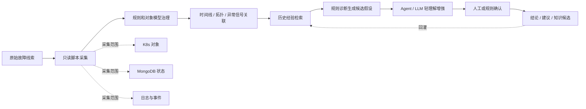

核心原则：

- 先诊断，后建议，最后处置。
- 默认只读，不自动执行修复动作。
- 不让 LLM 直接面对全量原始日志。
- 不让 LLM 单独做最终决策。
- 每个结论都必须能回到证据和资产来源。
- 历史经验只能作为假设和验证路径参考，不能替代当前现场证据。

### 3.4 Agent 平台策略

项目不绑定单一 Agent 平台。当前以 Claude Code 插件标准作为设计基线，同时通过 `core/interfaces/` 和 `plugins/<agent>/` 方式适配不同运行环境。

| 平台          | 角色                                | 当前状态                |
| ----------- | --------------------------------- | ------------------- |
| Cursor      | 首个验证平台，使用 agent-cli + slash commands 接入 | 已适配并有自动化 smoke test |
| Claude Code | 插件标准和命令形态的设计基线                    | 接口兼容，后续适配           |
| Codex       | 未来可选运行环境                          | 接口兼容，待实现            |

---

## 四、方案定位：我们到底在建设什么

### 4.1 产品定位

**Midstack Triage = 中间件排障知识体系 + 自动化采集工具链 + Agent 排障插件。**

它不替代现有监控系统，不替代中间件控制面，也不直接接管生产变更。它解决的是“告警之后如何标准化排查”的问题，把专家经验转成可执行的资产和流程。

### 4.2 面向用户的最小体验

用户侧主路径保持简单：`/midstack:start` 负责启动和环境确认，`/midstack:analyse` 直接产出诊断结论和报告；`/midstack:review` 是可选反馈闭环，用于评分、复盘和插件优化，不是拿到结论的必经步骤。

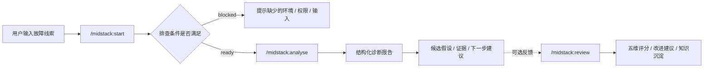

对外排障主路径是 `/midstack:start` 和 `/midstack:analyse`；`/midstack:review` 面向插件效果评价和持续改进。

### 4.3 五段式排障主流程

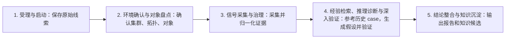

---

## 五、架构设计：设计主干与当前落地分开

这一章需要区分两个层面：**设计主干**解决知识如何组织、排障过程如何沉淀；**当前 MVP 落地**解决 MongoDB 和 Cursor 场景下如何先跑通、验证和回归。这样可以避免把临时实现形态误认为长期架构边界。

### 5.1 可扩展的知识资产架构：场景和中间件解耦

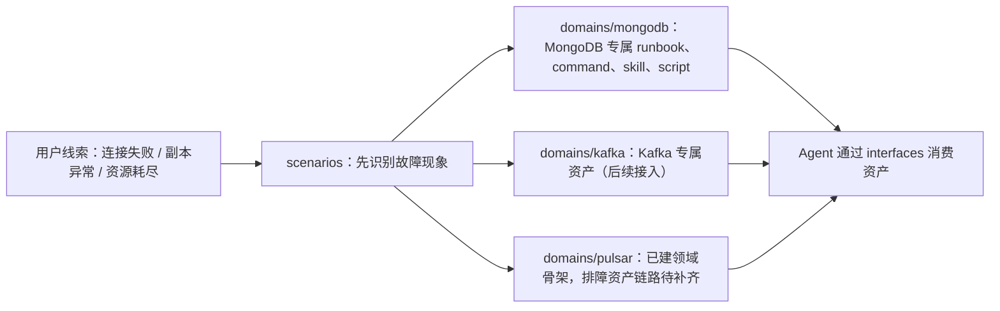

这张图想说明：用户报的是“现象”，不是某个目录或脚本。系统先把问题归入标准场景，再路由到对应中间件自己的排障资产。

设计上真正稳定的是三个边界：

- **场景层负责“是什么现象”**：`scenarios/` 只定义连接失败、资源耗尽、副本异常等跨中间件现象，不写产品专属步骤。
- **领域层负责“怎么排查”**：`domains/<product>/` 存放某个中间件自己的 runbook、command、skill、script。
- **接口层负责“怎么被 Agent 消费”**：`core/interfaces/` 让 Cursor、Claude Code、Codex 等平台消费同一套资产，不把知识写死在某个厂商实现里。

这样设计的目的，是避免为 MongoDB、Kafka、Pulsar 各写一套完全割裂的排障系统。共性场景统一命名和路由，产品差异保留在各自领域资产中。

### 5.2 知识资产关系

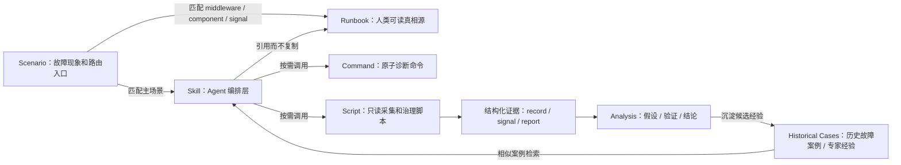

这里的关键不是目录长什么样，而是资产主从关系：

- runbook 是人类可读的真相源，不能在 skill 里复制第二份完整步骤。
- command 是单条原子诊断动作，不承载复杂控制流。
- script 负责采集、整理和结构化输出，不负责远程登录和凭据管理。
- skill 是 Agent 编排层，负责引用 runbook、command、script，并组织排障流程。
- 历史经验库用于沉淀过往故障案例、专家结论和相似问题验证路径，作为第 4 段推理诊断的重要输入。

### 5.3 一次排障的数据流

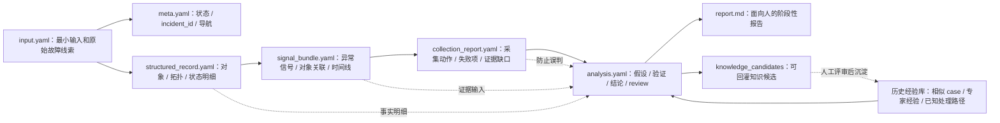

讨论文档里最稳定的设计之一，是“一次排障一个 incident 目录”。核心不是一定使用 YAML，而是每一类信息有明确职责：

- `input.yaml` 保留第一手输入，后续不静默覆盖。
- `structured_record.yaml` 保存对象、拓扑、状态和日志引用等结构化事实。
- `signal_bundle.yaml` 保存治理后的异常信号、对象关联和时间线。
- `collection_report.yaml` 明确采到了什么、没采到什么、为什么没采到。
- `analysis.yaml` 承载多假设、验证动作、阶段性结论和 review 反馈。
- 历史经验库是设计上的正式输入，用于检索相似故障、已验证路径和专家判断；当前 MVP 已有 knowledge candidates 和 fixture，但完整检索能力尚未实现。

### 5.4 推理诊断架构：多轮猜想、论证和深入分析

第 4 段推理诊断不应是“一次性给结论”，而应支持多轮猜想、证据论证和逐步收敛。Agent 每一轮都应围绕当前证据提出假设，再通过支持证据、反证条件、证据缺口和验证动作来推进。

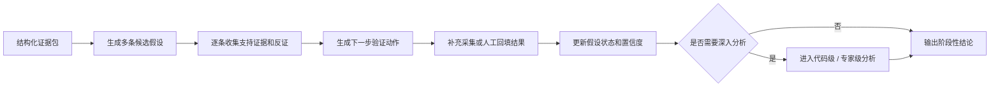

这一层的关键能力包括：

- **多轮猜想与论证**：保留多个候选假设，不急于押注单一结论；每条假设都要有支持证据、反证条件、证据缺口和验证状态。
- **证据驱动收敛**：每一轮补充采集或人工回填后，更新假设置信度，明确哪些方向被支持、哪些方向被排除、哪些方向仍不确定。
- **历史经验参与推理**：相似 case、专家结论、已验证处理路径可作为假设生成和验证路径参考，但不能替代当前现场证据。
- **代码级深入分析**：当证据指向平台逻辑、Operator、控制器、自动化脚本或中间件源码问题时，可以结合 Git MCP、本地源码项目或代码检索能力，进入代码路径分析。
- **专家级分析分支**：对复杂疑难问题，Agent 不只输出命令，还应沉淀“专家会如何继续查”的路径，包括要看哪些源码、哪些配置、哪些调用链、哪些历史变更。

代码级分析不是每次排障的默认路径，而是条件触发的深入分支。大多数生产故障应先在对象状态、拓扑、日志、事件、指标和历史经验层面收敛；只有当这些证据不足以解释问题，或明确怀疑平台/代码逻辑缺陷时，再进入 Git MCP 或本地源码项目分析。

### 5.5 当前 MVP 工程落地

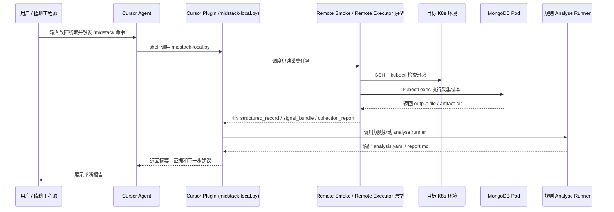

这张图描述的是当前 MongoDB MVP 的落地方式，不是长期架构必须固定成这样。当前为了尽快验证价值，仓库内保留了 `plugins/cursor/`、`tools/analyse/`、`tools/remote-smoke/`、`tests/fixtures/` 等工程支撑；长期边界仍然是知识资产、运行时适配和远程执行能力解耦。

尤其需要明确两点：

- 当前 `Analyse Runner` 是规则驱动 MVP，用于保底闭环和离线回归；设计上第 4 段仍然是 Agent 友好的推理诊断层，后续可引入 LLM 轻理解、多轮论证和代码级深入分析。
- 当前 Cursor 是首个验证平台；设计上通过 `core/interfaces/` 保持平台无关，后续可以适配 Claude Code、Codex 或其他 Agent 运行环境。

### 5.6 安全边界

安全边界不是口头承诺，而是通过脚本合同、资产 metadata、输出结构和后续 CI 门禁共同约束。

| 边界 | 当前机制 | 待补齐 |
|------|----------|--------|
| 默认只读 | MongoDB MVP 脚本定位为只读采集和 normalize，脚本 manifest / 资产约定标记风险属性 | CI 中强校验高风险脚本不得进入默认采集链路 |
| 诊断与处置分离 | 当前只输出诊断、证据、建议，不自动修复环境 | 设计人工确认流程，低风险 SOP 也必须显式批准后执行 |
| 高风险显式确认 | runbook 标注风险等级，处置动作不进入自动路径 | 建立高风险动作清单和审批记录格式 |
| 敏感信息不入库 | 环境配置放 `.local/`；Secret、密码等不写入 output / artifact / 日志摘要 | 增加脱敏检查和敏感字段扫描 |
| 可审计 | 输出 `structured_record`、`signal_bundle`、`collection_report`、`analysis.yaml` | 补齐归档规范、审计字段和报告留存策略 |

---

## 六、案例：使用插件排查 MongoDB 节点异常

---

## 七、后续演进与适配场景

Midstack Triage 后续不应只面向单一使用方式，而应按环境权限、模型来源、输入来源和输出形态分层适配。当前最清晰的三类场景如下。

### 7.1 研发测试环境：Agent 可直接进入环境排障

这是当前项目的主战场。研发测试环境通常允许大模型和 Agent 通过 SSH 进入跳板机或测试节点，再通过 `kubectl`、`kubectl exec`、中间件客户端命令执行只读采集。

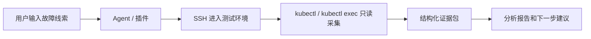

适配重点：

- 输入来自研发、测试或运维同学的故障描述、日志片段、环境 IP 和账号信息。
- 插件可以执行只读采集脚本，自动生成 `structured_record`、`signal_bundle`、`collection_report`。
- Agent 可以参与推理诊断、假设生成和验证动作建议。
- 默认仍然只诊断不处置，任何修改环境的动作都需要人工确认。

这个场景最适合继续打磨 MongoDB MVP，补齐 Remote Executor、CI 回归门禁、真实故障 fixture 和历史经验回灌。

### 7.2 线上生产环境：告警驱动、SRE 模型、报告优先

线上生产环境对安全和权限要求更高，模型能力可能由 SRE 平台统一提供，也可能使用 CPU 上运行的本地 `ollama` 模型。插件在这个场景下不能假设自己可以像研发环境一样直接拿到完整操作权限。

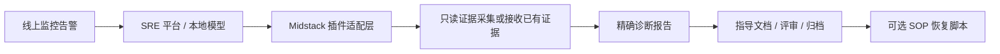

适配重点：

- 输入来源从人工描述扩展为线上监控告警、事件、日志系统、指标系统和已有 SRE 事件记录。
- 输出要比研发环境更正式：需要更精确、可审计、可归档的报告和指导文档。
- 模型来源可能不是 Cursor，而是 SRE 提供的模型服务或本地 `ollama` 模型，因此接口层要保持平台无关。
- 后续可以提供评审、归档、复盘能力，并逐步沉淀 SOP 故障恢复操作脚本。
- SOP 脚本默认不自动执行，只作为经过评审的恢复方案或人工确认后的执行材料。

这个场景的关键不是“让 Agent 自动修线上”，而是让线上告警到诊断报告、指导文档、SOP 归档之间形成可控闭环。

### 7.3 ToDesk 类特殊远程环境：离线排障指导

还有一类特殊环境，Agent 和插件无法直接 SSH 进入目标环境，只能依赖操作人员通过 ToDesk、远程桌面或人工复制粘贴来执行命令。这类场景下，插件要从“自动执行者”退化为“离线排障指导者”。

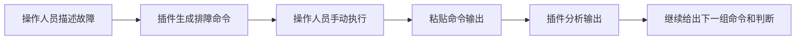

适配重点：

- 输入主要来自操作人员的故障描述、截图、命令输出和日志片段。
- 插件不直接接触目标环境，只生成排障命令、解释命令目的，并说明预期输出。
- 操作人员将命令输出贴回后，插件继续分析并给出下一步。
- 输出应更偏“分步指导手册”：每一步要说明为什么执行、如何判断、看到不同输出时怎么走分支。
- 适合无法开放 SSH、无法安装插件、或客户环境强隔离的场景。

这个场景下，Midstack Triage 的 runbook、command、skill 仍然有价值，只是执行方式从自动采集变成“人机协同的离线排障”。

### 7.4 演进总结

除环境形态适配外，中间件覆盖也需要继续扩展。MongoDB 已跑通 MVP 主链路，Pulsar 仅作为领域样例完成结构骨架（非第一版正式支持），完整排障资产链路仍在补齐；后续应按同一套结构继续适配 Redis、Elasticsearch、Kafka 等中间件。

扩展时不重新设计一套新系统，而是复用现有的 `scenarios/`、`domains/` 和 `core/`：

- `scenarios/` 继续沉淀连接失败、资源耗尽、延迟升高、运行时异常等跨中间件场景。
- `domains/mongodb` 先作为完整 MVP 链路打磨，`domains/pulsar` 补齐与 MongoDB 对齐的 runbook、command、skill、script 后，再扩展 `domains/redis`、`domains/elasticsearch` 等目录。
- Kubernetes runtime、日志采集、事件分析、历史经验检索等共性能力尽量复用。

### 7.5 资源与成本优化

随着接入中间件、故障场景和历史案例增多，后续需要专门优化模型调用成本和上下文资源消耗，尤其是 token、日志体量、历史案例检索范围和模型选择。

优化方向包括：

- **输入裁剪**：不把全量日志、全量 YAML、全量历史 case 直接塞给模型，先通过脚本和规则做摘要、去噪和结构化。
- **分层上下文**：第 3 段输出 `structured_record`、`signal_bundle`、`collection_report`，第 4 段只读取推理所需的证据摘要和必要明细。
- **按需检索历史经验**：历史案例库按场景、组件、信号、根因标签检索，避免每次加载大量无关案例。
- **模型分级使用**：简单分类、摘要、格式化优先用小模型或规则；复杂假设生成和结论整合再调用能力更强的模型。
- **缓存与复用**：对同一 incident 的采集结果、日志 highlights、历史 case 匹配结果做缓存，避免重复消耗 token。
- **线上环境成本控制**：生产场景下可结合 SRE 提供的模型服务或本地 `ollama` 模型，根据安全、成本和效果选择不同运行方式。

目标是让系统在规模扩大后仍然可控：既能利用大模型提升诊断体验，又不会因为 token 和模型调用成本过高而难以落地。

工程验收侧可以保留 `midstack_validate` 作为自检入口，用于验证资产校验、fixture replay、score gate 和 Cursor agent-cli 插件 smoke 是否通过；它不属于用户排障主路径。

三类环境场景的共同目标一致：把专家经验、标准命令、证据结构和历史案例沉淀为可复用能力。差异在于执行权限和输入来源：

| 场景         | 输入来源                 | 执行方式                        | 主要输出               |
| ---------- | -------------------- | --------------------------- | ------------------ |
| 研发测试环境     | 人工线索 + 环境接入信息        | Agent 通过 SSH / kubectl 只读采集 | 诊断报告、证据包、知识候选      |
| 线上生产环境     | 监控告警 + SRE 事件 + 观测数据 | 平台受控采集或接收已有证据               | 精确报告、指导文档、评审归档、SOP |
| ToDesk 类环境 | 人工描述 + 手动命令输出        | 插件生成命令，操作人员执行               | 离线排障步骤、输出解释、下一步建议  |

建议后续按“研发测试环境先跑深、线上生产环境再做稳、特殊远程环境做轻量指导”的顺序推进。

---
