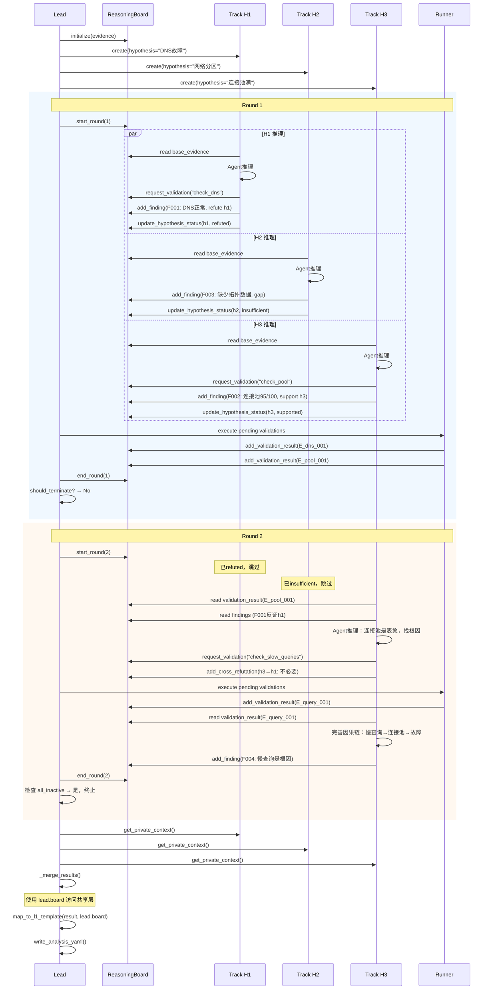

# 执行流程设计

## 1. 整体流程（鸟瞰）

```
[第3段证据包]
    ↓
[生成初始假设] ← 规则匹配 + 历史案例（第一版历史为空）
    ↓
[Lead: 评分选择2-5条假设]
    ↓
[初始化 ReasoningBoard + N条 HypothesisTrack]
    ↓
┌─────────────────────────────────────┐
│ Round 1                             │
│  ├─ Phase R1: 各轨基于已有证据推理                │
│  ├─   ├─ H1/H2/H3: findings + 请求验证（不写status）       │
│  └─ Phase E: 执行验证 → executed_validations                │
│  Phase R2: 基于新验证更新status + is_active                                  │
│ 检查 all_inactive → 否                  │
└─────────────────────────────────────┘
    ↓ 继续
┌─────────────────────────────────────┐
│ Round 2                             │
│  └─ 检查 all_inactive → 是，跳出   │
└─────────────────────────────────────┘
    ↓ 终止（max_rounds 或 all_conclusive）
[Lead: 合并所有轨]
    ├─ 读取 reasoning-board（共享层）
    ├─ 读取各轨私有上下文
    ├─ 选择最优因果链
    └─ 生成 analysis.yaml
```

---

## 2. Lead 主循环详细流程

```python
def lead_main_loop_pseudocode():
    # ========== 初始化阶段 ==========
    
    # 1. 装载第3段证据
    evidence_package = load_from_incident_dir([
        "structured_record.yaml",
        "signal_bundle.yaml",
        "collection_report.yaml"
    ])
    
    # 2. 生成初始假设
    initial_hypotheses = []
    
    # 2.1 规则匹配假设
    rule_hypotheses = rule_based_hypothesis_generation(evidence_package)
    initial_hypotheses.extend(rule_hypotheses)
    
    # 2.2 历史案例假设（第一版为空）
    # historical_hypotheses = search_historical_cases(evidence_package)
    # initial_hypotheses.extend(historical_hypotheses)
    
    # 3. 评分选择假设
    scored_hypotheses = [
        (h, score_hypothesis(h))
        for h in initial_hypotheses
    ]
    scored_hypotheses.sort(key=lambda x: x[1], reverse=True)
    
    # 至少2轨，最多5轨
    selected_count = max(2, min(len(scored_hypotheses), MAX_TRACKS))
    selected_hypotheses = [h for h, _ in scored_hypotheses[:selected_count]]
    
    # 4-14. 执行推理和合并 → 见 §9 完整三相位实现
```

---

## 3. 单轨推理流程

见 `design-interfaces.md` 中的 `HypothesisTrack` 类：
- `run_phase_r1()` - Phase R1：基于已有证据推理
- `run_phase_r2()` - Phase R2：基于新验证结果更新
- `_observe()` - 读取共享层
- `_reason()` - 调用Agent推理
- `_take_actions_phase_r1()` - 写入发现和请求验证

---
---

## 4. 验证执行流程（Runner侧）

```python
def execute_validation_pseudocode(action_name, evidence_package):
    """执行单个验证动作"""
    
    # 1. 根据 action_name 路由到具体collector
    if action_name == "check_dns_resolution":
        result = check_dns_resolution(evidence_package)
    
    elif action_name == "check_connection_pool_metrics":
        result = check_connection_pool_metrics(evidence_package)
    
    elif action_name == "check_slow_queries":
        result = check_slow_queries(evidence_package)
    
    else:
        # 未知动作，标记为gap
        result = ValidationResult(
            text=f"未知验证动作：{action_name}",
            type="gap",
            data={}
        )
    
    return result

def check_dns_resolution(evidence_package):
    """示例：DNS验证"""
    # 从 structured_record 提取 DNS 相关数据
    dns_data = extract_dns_from_record(evidence_package.structured_record)
    
    if not dns_data:
        return ValidationResult(
            text="无DNS数据",
            type="gap",
            data={}
        )
    
    # 分析
    avg_response = dns_data.get("avg_response_ms", 0)
    success_rate = dns_data.get("success_rate", 0)
    
    if success_rate >= 0.95 and avg_response < 100:
        return ValidationResult(
            text=f"DNS响应正常，平均{avg_response}ms，成功率{success_rate}",
            type="refutation",  # 反证DNS故障假设
            data={
                "avg_response_ms": avg_response,
                "success_rate": success_rate
            }
        )
    else:
        return ValidationResult(
            text=f"DNS异常，平均{avg_response}ms，成功率{success_rate}",
            type="support",  # 支持DNS故障假设
            data={
                "avg_response_ms": avg_response,
                "success_rate": success_rate
            }
        )
```

---

## 5. 终止条件判断流程

```python
def should_terminate_pseudocode(board, round_num, tracks):
    """判断是否终止多轮推理"""
    
    # 1. 硬上限：达到最大轮次
    if round_num >= MAX_ROUNDS:
        return True
    
    # 2. 所有轨已停止
    all_inactive = all(not t.is_active for t in tracks)
    if all_inactive:
        return True
    
    # 3. 智能终止（TD-002，第一版不实现）
    # has_supported = any(
    #     s.status == "supported" 
    #     for s in board.get_all_hypothesis_status().values()
    # )
    # has_critical_gap = any(
    #     f.type == "gap" and f.get("criticality") == "high"
    #     for f in board.get_all_findings()
    # )
    # if has_supported and not has_critical_gap:
    #     return True
    
    return False

def get_termination_reason(board, round_num, tracks):
    """获取终止原因"""
    if round_num >= MAX_ROUNDS:
        return "max_rounds_reached"
    
    all_inactive = all(not t.is_active for t in tracks)
    if all_inactive:
        return "all_hypotheses_conclusive"
    
    return "unknown"
```

---

## 7. 时序图



---

## 8. 关键决策点总结

| 决策点 | 第一版实现 | 后续优化（技术债） |
|--------|-----------|-------------------|
| 假设轨数量 | 固定上限5，简单评分 | TD-001: 动态2-5，完整评分算法 |
| 轮次终止 | 固定3轮 | TD-002: 智能终止条件 |
| 轨并行执行 | 顺序执行（for loop） | 真并行（async/线程池） |
| Agent调用 | mock实现 | 集成真实Agent API |
| 补采触发 | 规则预补采（Agent前） | TD-003: Agent主导补采循环 |
| 因果链合并 | 选最高置信度 | TD-007: 尝试合并兼容链 |
| 黑板并发写 | 单进程Lock | 多进程/分布式锁 |

---

## 9. 集成到 midstack-local.py（修复 P0-9）

**嵌入点**：多轨推理替代原有的 Cursor Agent 合同，但保留规则 draft 和 directed_recollection

```python
# tools/plugin/midstack-local.py

def analyse(args):
    """analyse 命令入口"""
    incident_dir = Path(args.incident_dir)
    
    # ===== 第 1-3 段保持不变 =====
    # （现有代码不动）
    
    # ===== 规则预补采（保持不变）=====
    recollection_needed = run_directed_recollection_if_needed(incident_dir)
    # 如果需要补采，执行后继续
    
    # ===== 规则 analyse 草稿（保持，作为初始假设来源）=====
    draft = analyse_with_rules(incident_dir)  
    # 生成 analysis.rule-draft.yaml
    
    # ===== 【新】第 4 段：多轨推理（替代 write_agent_reasoning_task + Cursor Agent）=====
    analysis = run_phase4_multitrack(incident_dir, rule_draft=draft)
    # 替代原有：
    #   write_agent_reasoning_task(incident_dir)  ← 废弃
    #   Cursor 读 agent-reasoning-task.md       ← 废弃
    
    # ===== 第 5 段：finalize + review（保持不变）=====
    finalize_analysis(incident_dir, analysis)  # 现有代码
    
    if should_review(incident_dir):
        review_analysis(incident_dir)  # 现有代码

def run_phase4_multitrack(incident_dir: Path, rule_draft: Dict) -> Dict:
    """第 4 段多轨推理（新增）
    
    Args:
        incident_dir: incident 目录
        rule_draft: analysis.rule-draft.yaml 内容（初始假设来源）
    
    Returns:
        analysis: 符合 L1 模板的 analysis.yaml 内容
    """
    from .phase4_multitrack import LeadOrchestrator
    
    # 1. 从 rule_draft 提取初始假设
    initial_hypotheses = extract_hypotheses_from_draft(rule_draft)
    
    # 2. 初始化 Lead
    lead = LeadOrchestrator(
        incident_dir=incident_dir,
        max_rounds=3,
        max_tracks=5
    )
    
    # 3. 初始化轨
    lead.initialize_tracks(initial_hypotheses)
    
    # 4. 运行多轮推理（三相位）
    result = lead.run()
    
    # 5. 映射到 L1 模板格式（修复阻塞点1）
    analysis_yaml = map_to_l1_template(result, lead.board)
    
    # 6. 写入 analysis.yaml
    write_analysis_yaml(incident_dir, analysis_yaml)
    
    return analysis_yaml

def extract_hypotheses_from_draft(draft: Dict) -> List[Dict]:
    """从规则草稿提取初始假设"""
    hypotheses = []
    
    for h in draft.get("hypotheses", []):
        hypotheses.append({
            "id": h["hypothesis_id"],
            "description": h["statement"],
            "initial_confidence": 0.5,  # 规则草稿置信度
            "source": "rule_based",
            "evidence_support": bool(h.get("supporting_evidence"))
        })
    
    return hypotheses

def map_to_l1_template(result: Dict, board: 'ReasoningBoard') -> Dict:
    """映射到 L1 模板格式（完整版，修复阻塞点1）"""
    return {
        "hypotheses": [
            map_hypothesis_to_l1(h, board)
            for h in result["hypotheses"]
        ],
        "conclusion_summary": build_conclusion_summary(result, board),
        "next_actions": extract_next_actions(result, board),
        "knowledge_candidates": extract_knowledge_candidates(result, board),
        "generated_at": datetime.now(timezone.utc).isoformat(),
        "updated_at": datetime.now(timezone.utc).isoformat()
    }

def map_hypothesis_to_l1(hypothesis: Dict, board: 'ReasoningBoard') -> Dict:
    """映射单个假设到 L1 格式"""
    hypothesis_id = hypothesis["id"]
    findings = board.get_findings_for_hypothesis(hypothesis_id)
    validations = board.get_validations_for_hypothesis(hypothesis_id)
    
    return {
        "hypothesis_id": hypothesis_id,
        "statement": hypothesis["description"],
        "causal_path": causal_chain_to_path(hypothesis.get("causal_chain")),
        "supporting_evidence": extract_supporting_evidence(findings, board),
        "counter_evidence": extract_counter_evidence(findings, board),
        "disconfirming_conditions": extract_disconfirming_conditions(hypothesis),
        "evidence_gaps": extract_evidence_gaps_for_hypothesis(hypothesis_id, board),
        "validation_actions": extract_validation_actions(validations),
        "validation_result": hypothesis["status"]
    }

def build_conclusion_summary(result: Dict, board: 'ReasoningBoard') -> Dict:
    """构建 conclusion_summary（修复阻塞点1）"""
    supported = [h for h in result["hypotheses"] if h["status"] == "supported"]
    
    if supported:
        primary = supported[0]
        deepest_level = determine_deepest_level(primary)
        
        # 根据证据深度调整statement措辞
        level_prefix = {
            "root_cause": "根因",
            "mechanism": "机制",
            "impact": "影响",
            "phenomenon": "现象"
        }
        prefix = level_prefix.get(deepest_level, "分析")
        
        return {
            "statement": f"{prefix}：{primary['description']}",
            "confidence": confidence_float_to_enum(primary["confidence"]),
            "impact_scope": extract_impact_scope(primary, board),
            "primary_cause_category": determine_cause_category(primary),
            "evidence": extract_key_evidence(primary, board),
            "limitations": extract_limitations(result["hypotheses"], board),
            "deepest_supported_level": deepest_level
        }
    else:
        return {
            "statement": "所有假设均未确认",
            "confidence": "low",
            "impact_scope": {},
            "primary_cause_category": "unknown",
            "evidence": [],
            "limitations": ["证据不足以确定根因"],
            "deepest_supported_level": "phenomenon"
        }

def determine_cause_category(hypothesis: Dict) -> str:
    """判断原因类别（枚举：configuration/resource_exhaustion/network_issue/code_defect/other）"""
    desc_lower = hypothesis["description"].lower()
    
    if any(k in desc_lower for k in ["配置", "参数", "config"]):
        return "configuration"
    if any(k in desc_lower for k in ["连接池", "内存", "cpu", "pool", "resource"]):
        return "resource_exhaustion"
    if any(k in desc_lower for k in ["网络", "连接", "超时", "network", "timeout"]):
        return "network_issue"
    if any(k in desc_lower for k in ["代码", "bug", "code"]):
        return "code_defect"
    return "other"

def determine_deepest_level(hypothesis: Dict) -> str:
    """判断分析深度（枚举：phenomenon/impact/mechanism/root_cause）"""
    status = hypothesis.get("status")
    causal_chain = hypothesis.get("causal_chain")
    
    if status == "supported" and causal_chain and len(causal_chain.get("nodes", [])) >= 3:
        return "root_cause"
    if causal_chain:
        return "mechanism"
    if hypothesis.get("description"):
        return "impact"
    return "phenomenon"

# 辅助函数（详细实现见 blocker-1-complete-mapping.md）
def extract_supporting_evidence(findings: List[Dict], board: 'ReasoningBoard') -> List[Dict]:
    """提取支持证据"""
    evidence_list = []
    for f in findings:
        if f["type"] in ["support", "observation"]:
            for evidence_id in f.get("evidence", []):
                val_result = board.get_validation_result_data(evidence_id)
                if val_result:
                    evidence_list.append({
                        "source": val_result.get("action", "unknown"),
                        "detail": val_result.get("result", f["content"])
                    })
    return evidence_list if evidence_list else [{"source": "none", "detail": "无直接支持证据"}]

def extract_counter_evidence(findings: List[Dict], board: 'ReasoningBoard') -> List[Dict]:
    """提取反证"""
    counter_list = []
    for f in findings:
        if f["type"] == "refutation":
            for evidence_id in f.get("evidence", []):
                val_result = board.get_validation_result_data(evidence_id)
                if val_result:
                    counter_list.append({
                        "source": val_result.get("action", "validation"),
                        "detail": val_result.get("result", f["content"])
                    })
    return counter_list

def extract_disconfirming_conditions(hypothesis: Dict) -> List[str]:
    """提取反证条件"""
    statement = hypothesis["description"].lower()
    conditions = []
    if "dns" in statement:
        conditions.append("DNS响应正常且延迟低于阈值")
    if "连接池" in statement or "pool" in statement:
        conditions.append("连接池未满载（<80%）")
    if "网络" in statement or "network" in statement:
        conditions.append("网络连通性正常，无丢包")
    if not conditions:
        conditions.append("存在其他完整因果链解释现象")
    return conditions

def extract_evidence_gaps_for_hypothesis(hypothesis_id: str, board: 'ReasoningBoard') -> List[str]:
    """提取证据缺口"""
    return board.get_evidence_gaps_for_hypothesis(hypothesis_id)

def extract_validation_actions(validations: List[Dict]) -> List[Dict]:
    """提取验证动作"""
    status_map = {"pending": "planned", "executing": "planned", "completed": "executed", "failed": "blocked"}
    return [{
        "action": v["action"],
        "status": status_map.get(v["status"], "planned"),
        "result": v.get("result", "") if v["status"] == "completed" else ""
    } for v in validations]

def extract_key_evidence(hypothesis: Dict, board: 'ReasoningBoard') -> List[str]:
    """提取关键证据"""
    findings = board.get_findings_for_hypothesis(hypothesis["id"])
    evidence_list = [f["content"] for f in findings if f["type"] == "support"]
    return evidence_list[:3] if evidence_list else ["无明确支持证据"]

def extract_impact_scope(hypothesis: Dict, board: 'ReasoningBoard') -> str:
    """提取影响范围"""
    return "受影响组件：MongoDB, 连接池"

def extract_limitations(hypotheses: List[Dict], board: 'ReasoningBoard') -> List[str]:
    """提取分析局限"""
    limitations = []
    gaps = board.get_all_evidence_gaps()
    if gaps:
        limitations.append(f"存在 {len(gaps)} 个证据缺口")
    insufficient = [h for h in hypotheses if h["status"] == "insufficient"]
    if insufficient:
        limitations.append(f"{len(insufficient)} 个假设证据不足")
    return limitations if limitations else ["无明显局限"]

def extract_next_actions(result: Dict, board: 'ReasoningBoard') -> List[Dict]:
    """提取后续动作"""
    actions = []
    supported = [h for h in result["hypotheses"] if h["status"] == "supported"]
    if supported:
        primary = supported[0]
        desc_lower = primary["description"].lower()
        if "慢查询" in desc_lower or "slow query" in desc_lower:
            actions.append({"action": "优化慢查询或增加索引", "risk_level": "low-risk", "requires_confirmation": True})
        if "连接池" in desc_lower or "pool" in desc_lower:
            actions.append({"action": "调整连接池大小或超时参数", "risk_level": "low-risk", "requires_confirmation": True})
    return actions if actions else [{"action": "人工复核验证结论", "risk_level": "read-only", "requires_confirmation": True}]

def extract_knowledge_candidates(result: Dict, board: 'ReasoningBoard') -> List[Dict]:
    """提取知识候选"""
    candidates = []
    supported = [h for h in result["hypotheses"] if h["status"] == "supported"]
    for h in supported:
        candidates.append({
            "candidate_id": f"runbook_{h['id']}",
            "candidate_type": "runbook",
            "title": f"排查与修复：{h['description']}",
            "reason": "该假设被验证支持，可沉淀为runbook",
            "suggested_path": f"domains/mongodb/runbooks/{slugify(h['description'])}.yaml"
        })
    return candidates

def slugify(text: str) -> str:
    """文本转slug"""
    import re
    text = text.lower().replace(" ", "-")
    return re.sub(r'[^a-z0-9-]', '', text)[:50]
```

**关键变更**：
- ❌ 废弃：`write_agent_reasoning_task()` 和 `agent-reasoning-task.md`
- ✅ 保留：`analysis.rule-draft.yaml`（作为初始假设来源）
- ✅ 保留：`directed_recollection`（规则预补采）
- ✅ 新增：`run_phase4_multitrack()`（替代 Cursor Agent）
- ✅ 新增：`map_to_l1_template()`（确保 L1 模板兼容）
