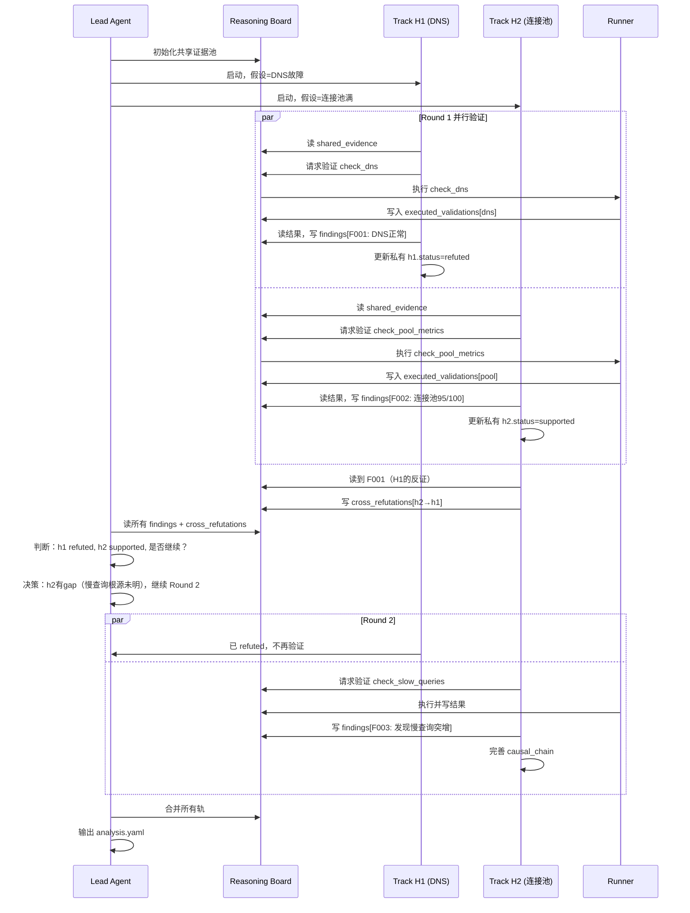

# 多轨假设验证：隔离与共享机制设计

## 已确认的边界条件

1. **执行模式**：多轨并行（每个初始假设独立推理轨）
2. **轮次上限**：3轮
3. **故障主线**：时间线（第3段证据）+ 主导因果链（第4段动态更新）
4. **假设演化**：保留+标记状态（refuted/supported/insufficient），不删除

## 核心设计问题

**多条假设轨并行执行时，如何平衡：**
- **隔离**：避免过早锚定、避免确认偏误
- **共享**：避免重复验证、传递反证、利用互补发现

---

## 方案：两层隔离-共享模型（已确认）

**设计原则**：隔离推理过程（避免锚定），共享客观证据与结果（避免重复）。

```
隔离层：假设上下文（Private Hypothesis Context）
  ├─ 推理思考过程（reasoning_log）
  ├─ 假设演化路径（hypothesis_evolution）：为什么从h0变成h1
  └─ 因果链构建（causal_chain）：主观解读的因果关系

共享层：客观证据与结果（Shared Evidence & Results）
  ├─ 第3段证据包（structured_record, signal_bundle, timeline）
  ├─ 历史案例（historical_cases）
  ├─ 已执行的验证及结果（executed_validations）
  ├─ 客观发现（findings）
  ├─ 假设状态（hypothesis_status: refuted/supported/insufficient）
  ├─ 验证动作请求队列（validation_queue）
  ├─ 反证记录（cross_refutations）
  └─ 证据缺口（evidence_gaps）
```

**关键边界决策**：
- ✅ 验证动作请求 → **共享**（避免重复执行）
- ✅ 因果链构建 → **隔离**（主观解读，各轨独立）
- ✅ 假设状态 → **共享**（客观结果，其他轨可利用）

---

## 共享层详细设计

**原则**：所有轨访问相同的客观证据与结果，避免信息不对称和重复验证。

```yaml
# 共享证据池（所有轨可读，任何轨不可写）
shared_evidence:
  # 第3段产出
  structured_record: {...}
  signal_bundle: {...}
  collection_report: {...}
  
  # 时间线（故障主线之一）
  timeline:
    - time: "2026-06-12T14:23:05Z"
      event: "连接开始失败"
      source: "mongodb-log"
    - time: "2026-06-12T14:23:12Z"
      event: "Pod mongodb-0 重启"
      source: "k8s-event"
  
  # 已执行的验证动作（避免重复）
  executed_validations:
    - action: check_dns_resolution
      result: "DNS正常，平均响应12ms"
      evidence_id: E_dns_001
      executed_by: track_h1
      round: 1
    - action: check_connection_pool_metrics
      result: "连接数 95/100，接近上限"
      evidence_id: E_pool_001
      executed_by: track_h3
      round: 1
```

  # 假设状态（NEW：客观结果，共享）
  hypothesis_status:
    h1: refuted
    h2: supported
    h3: insufficient
  
  # 验证动作请求队列（NEW：避免重复执行）
  validation_queue:
    - action: check_dns_resolution
      requested_by: [h1]
      status: completed
      result_id: E_dns_001
    - action: check_pool_metrics
      requested_by: [h3]
      status: completed
      result_id: E_pool_001

**访问规则**：
- ✅ 所有轨可读完整共享层
- ✅ 轨可追加验证请求到 `validation_queue`
- ✅ 轨可追加 `findings` 和 `cross_refutations`
- ✅ 轨可读取其他轨的假设状态
- ❌ 轨不可修改已有记录（只能追加）

---

## 隔离层详细设计

**原则**：每条轨独立维护推理过程，其他轨完全不可见，Lead 合并时才读取。

```yaml
# 共享推理黑板（reasoning_board）
reasoning_board:
  # 关键发现（各轨追加，不可修改他轨内容）
  findings:
    - id: F001
      track: h1  # 来源轨
      round: 1
      type: refutation
      content: "DNS解析正常，h1假设被反证"
      evidence: [E_dns_001]
      affects:  # 显式标记影响哪些假设
        - hypothesis: h1
          impact: refute
    
    - id: F002
      track: h3
      round: 1
      type: support
      content: "连接池接近满载，与故障onset时间吻合"
      evidence: [E_pool_001, timeline[0]]
      affects:
        - hypothesis: h3
          impact: support
    
    - id: F003
      track: h2
      round: 1
      type: gap
      content: "无法获取overlay网络拓扑，h2假设无法验证"
      affects:
        - hypothesis: h2
          impact: insufficient
  
  # 跨轨反证
  cross_refutations:
    - from_track: h3
      to_hypothesis: h1
      finding_id: F002
      reason: "连接池问题可以解释现象，DNS假设不必要"
      confidence: medium
  
  # 证据缺口池
  evidence_gaps:
    - gap: "overlay_network_topology"
      requested_by: [h2]
      status: unavailable
      reason: "CNI插件未启用拓扑导出"
```

**访问规则**：
- ✅ 轨只能读写自己的隔离上下文
- ❌ 其他轨完全不可见
- ✅ Lead 合并时读取所有轨的隔离上下文

**关键设计**：因果链在隔离层，每条轨独立构建，Lead 合并时选择最优

```yaml
# 轨 H1 的私有上下文（其他轨不可见）
track_h1_private:
  hypothesis_evolution:
    - round: 0
      hypothesis:
        id: h1
        desc: "DNS解析失败导致连接超时"
        status: pending
    - round: 1
      hypothesis:
        id: h1
        desc: "DNS解析失败导致连接超时"
        status: refuted
        reason: "DNS响应正常（F001）"
  
  # 该轨构建的因果链（可能与其他轨不同）
  causal_chain:
    nodes:
      - id: N1
        event: "配置变更"
        time: "14:20:00"
      - id: N2
        event: "DNS解析失败"
        status: refuted
      - id: N3
        event: "连接超时"
    edges:
      - from: N1
        to: N2
        confidence: 0.3  # 因N2被反证，整条链弱化
  
  # 该轨的推理上下文（思考过程）
  reasoning_log:
    - round: 1
      thought: "时间线显示14:23开始故障，14:20有配置变更"
      action: "验证DNS"
      result: "DNS正常，假设不成立"

# 轨 H3 的私有上下文
track_h3_private:
  hypothesis_evolution:
    - round: 0
      hypothesis:
        id: h3
        desc: "连接池耗尽"
        status: pending
    - round: 1
      hypothesis:
        id: h3
        desc: "连接池耗尽，可能由慢查询引发"
        status: supported
  
  causal_chain:
    nodes:
      - id: N1
        event: "慢查询突增"
        time: "14:22:50"  # 比故障早13秒
      - id: N2
        event: "连接池积压"
      - id: N3
        event: "新连接失败"
    edges:
      - from: N1
        to: N2
        confidence: 0.7
      - from: N2
        to: N3
        confidence: 0.9
```

**访问规则**：
- ✅ 轨只能读写自己的隔离上下文
- ❌ 其他轨完全不可见
- ✅ Lead 合并时读取所有轨的隔离上下文

---

## 关键机制示例

### 机制1: 反证传递（通过共享层）

```
轨 H1（DNS故障）:
  发现：DNS响应正常
  → 写入共享层 findings[F001]: type=refutation, affects=h1
  → 写入共享层 hypothesis_status[h1] = refuted
  
轨 H3（连接池满）读取共享层:
  看到 F001（DNS正常）
  看到 hypothesis_status[h1] = refuted
  → 判断：连接池可以完整解释现象，DNS假设已排除
  → 写入共享层 cross_refutations: from=h3, to=h1, reason="不必要假设"
  
Lead 合并时:
  读取共享层：h1被自身反证 + h3交叉反证
  → 判定 h1 confidence=high(refuted)
```

### 机制2: 验证去重（通过共享层）

```
轨 H1 请求验证:
  → 写入共享层 validation_queue: {action: check_dns, requested_by: [h1]}
  
轨 H2 同时请求验证:
  → 读取共享层 validation_queue
  → 发现 check_dns 已在队列
  → 不重复请求，等待结果
  
Runner 执行:
  → 执行 check_dns
  → 写入共享层 executed_validations: {action: check_dns, result: "正常", shared_to: [h1, h2]}
  
轨 H1, H2 同时读取结果
```

### 机制3: 独立因果链构建（在隔离层）

```
轨 H1（隔离上下文）:
  构建因果链: "配置变更 → DNS故障 → 连接失败"
  → 存储在 track_h1_private.causal_chain
  → 其他轨不可见

轨 H3（隔离上下文，并行）:
  构建因果链: "慢查询突增 → 连接池满 → 新连接失败"
  → 存储在 track_h3_private.causal_chain
  → 其他轨不可见

Lead 合并:
  读取所有隔离上下文
  → h1.causal_chain (confidence=0.2, 因h1被refuted)
  → h3.causal_chain (confidence=0.8, 因h3被supported)
  → 选择 h3.causal_chain 作为主导因果链
```

---

## 完整工作流（示例：2轨 × 2轮）



---

## 关键设计决策点

### D1: 验证动作去重

**场景**：轨H1和H2都想验证 `check_dns_resolution`。

**方案**：
```yaml
# 轨H1先请求
validation_request_queue:
  - action: check_dns_resolution
    requested_by: [h1]
    status: executing

# 轨H2后请求，发现重复
# Runner 合并请求，执行一次，结果写入 shared
executed_validations:
  - action: check_dns_resolution
    result: "DNS正常"
    shared_to: [h1, h2]  # 两个轨都能用
```

### D2: 反证的及时性

**问题**：轨H1在Round 1被反证，是否立即停止？

**方案**：
- **不立即停止** - 让轨完成当前轮次
- **标记 `status=refuted`** 后，下一轮不再分配新验证任务
- **保留推理路径** - 用于 Lead 合并时的审计

### D3: 因果链冲突

**场景**：
- 轨H1构建：`配置变更 → DNS → 故障`
- 轨H2构建：`慢查询 → 连接池 → 故障`
- 两条链互斥

**方案 Lead 合并策略**：
```python
def merge_causal_chains(tracks):
    chains = [t.causal_chain for t in tracks]
    
    # 按假设支持度排序
    sorted_chains = sorted(chains, key=lambda c: c.confidence, reverse=True)
    
    # 选择置信度最高的作为主导因果链
    leading_chain = sorted_chains[0]
    
    # 其他链作为备选
    alternative_chains = sorted_chains[1:]
    
    return {
        "leading_causal_chain": leading_chain,
        "alternative_chains": alternative_chains
    }
```

### D4: 轮次终止条件

每轮结束后，Lead 判断：

```python
def should_continue(board, round_num):
    # 硬上限
    if round_num >= 3:
        return False
    
    # 智能终止
    has_supported = any(h.status == "supported" for h in board.hypotheses)
    has_critical_gap = any(
        f.type == "gap" and f.criticality == "high" 
        for f in board.findings
    )
    
    # 有支持假设 且 无关键缺口 → 可以终止
    if has_supported and not has_critical_gap:
        return False
    
    # 所有假设都已 refuted/supported → 终止
    all_conclusive = all(
        h.status in ["refuted", "supported"] 
        for h in board.hypotheses
    )
    if all_conclusive:
        return False
    
    # 否则继续
    return True
```

---

## 实现建议

### 阶段1：最小可行（2周）

- 2条固定假设轨（H1, H2）
- 只实现 Layer 1（只读共享）+ Layer 2 的 findings
- 黑板不落盘，只在 Lead 上下文
- 轮次固定2轮（先不做智能终止）

### 阶段2：完整版（4周）

- 动态假设轨（2-5条）
- 完整 Layer 2（cross_refutations + gaps）
- 黑板落盘为 `reasoning-board.yaml`
- 智能终止条件
- 因果链合并

---

## 与现有实现的对接

```python
# tools/plugin/midstack-local.py

def analyse_phase4(incident_dir):
    # 装载第3段证据
    evidence = load_evidence_package(incident_dir)
    
    # 初始化共享黑板
    board = ReasoningBoard(evidence)
    
    # 生成初始假设（规则 + 历史）
    hypotheses = generate_initial_hypotheses(evidence)
    
    # 启动多轨
    tracks = [
        HypothesisTrack(h, board) 
        for h in hypotheses[:3]  # 最多3轨
    ]
    
    # Lead 循环
    for round_num in range(1, 4):  # 最多3轮
        # 并行执行各轨
        for track in tracks:
            if track.status not in ["refuted", "supported"]:
                track.run_round(round_num)
        
        # 判断是否继续
        if not should_continue(board, round_num):
            break
    
    # 合并
    analysis = merge_tracks(tracks, board)
    write_analysis_yaml(incident_dir, analysis)
```

---

## 待讨论问题

1. **假设轨数量**：固定3条，还是动态2-5条？
2. **黑板落盘**：第一版要不要写 `reasoning-board.yaml`？
3. **因果链**：是否每条轨都构建独立因果链，还是只有 supported 轨才构建？
4. **历史案例**：如何影响初始假设生成（现在数据库未实现）？

---

## 总结

**三层共享模型平衡了隔离与共享：**

| 层级 | 共享内容 | 隔离内容 | 目的 |
|------|---------|---------|------|
| Layer 1 | 基础证据 | - | 避免信息不对称 |
| Layer 2 | 发现、反证、缺口 | - | 协作不重复、传递反证 |
| Layer 3 | - | 推理路径、因果链 | 独立探索、避免锚定 |

**关键创新点**：
1. `executed_validations` 去重机制
2. `cross_refutations` 跨轨反证传递
3. `evidence_gaps` 避免重复请求不可得数据
4. 保留所有假设演化路径（审计友好）
