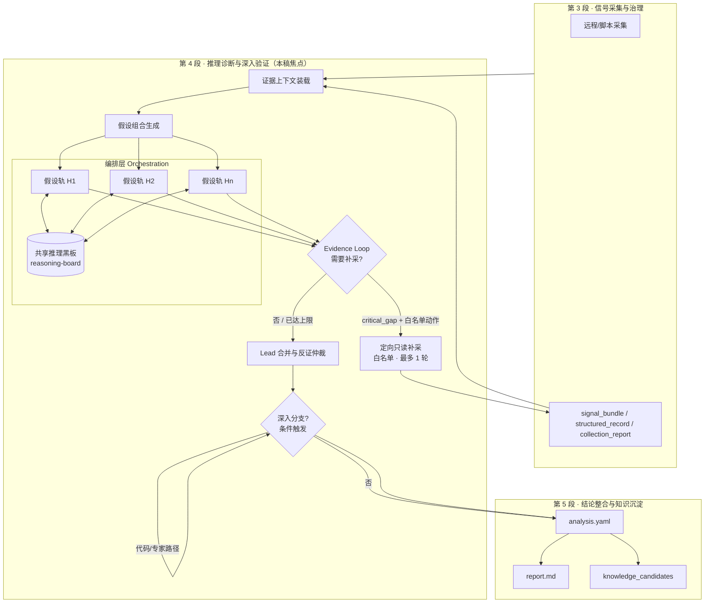
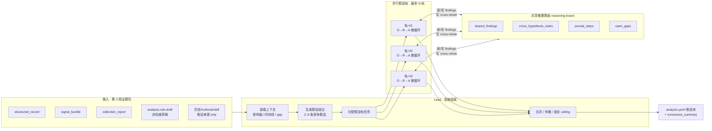
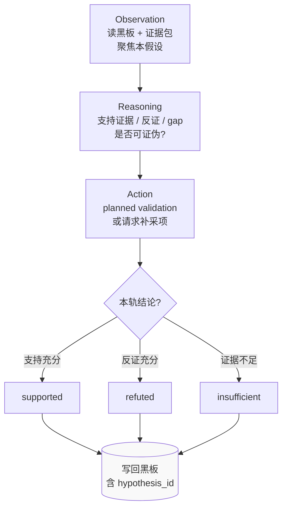
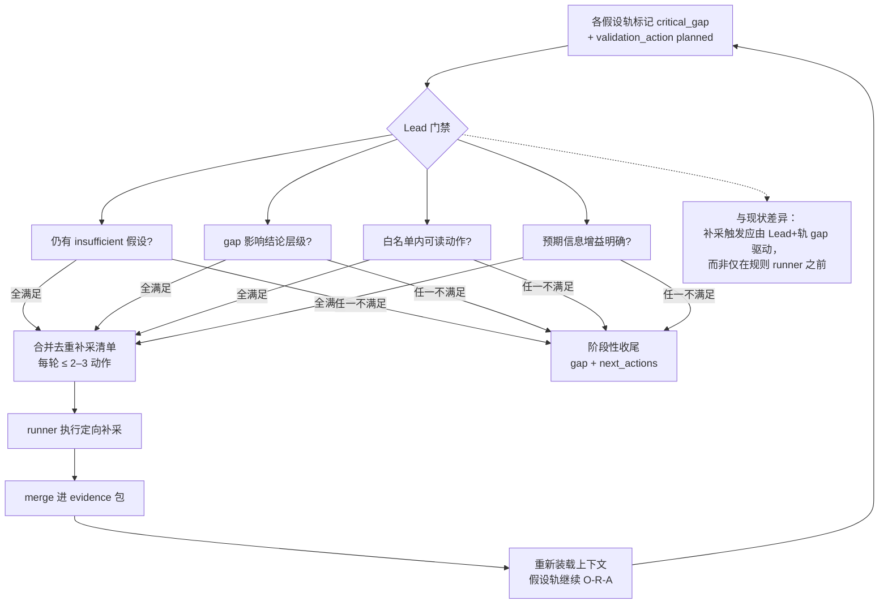
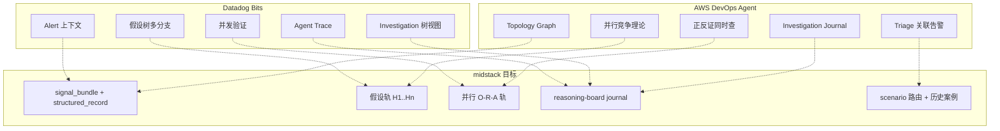
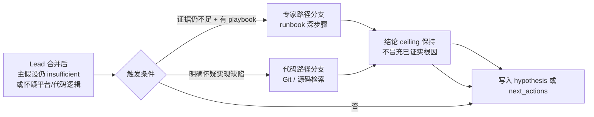
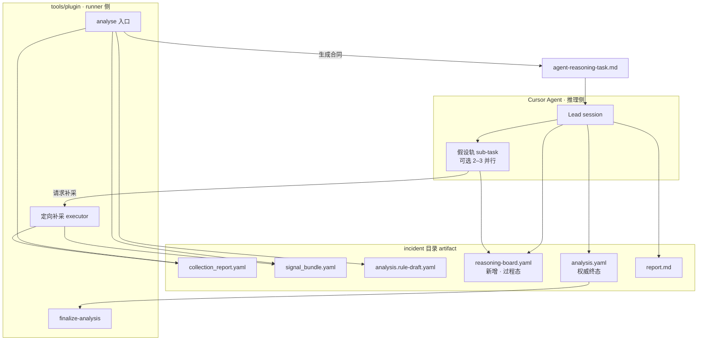
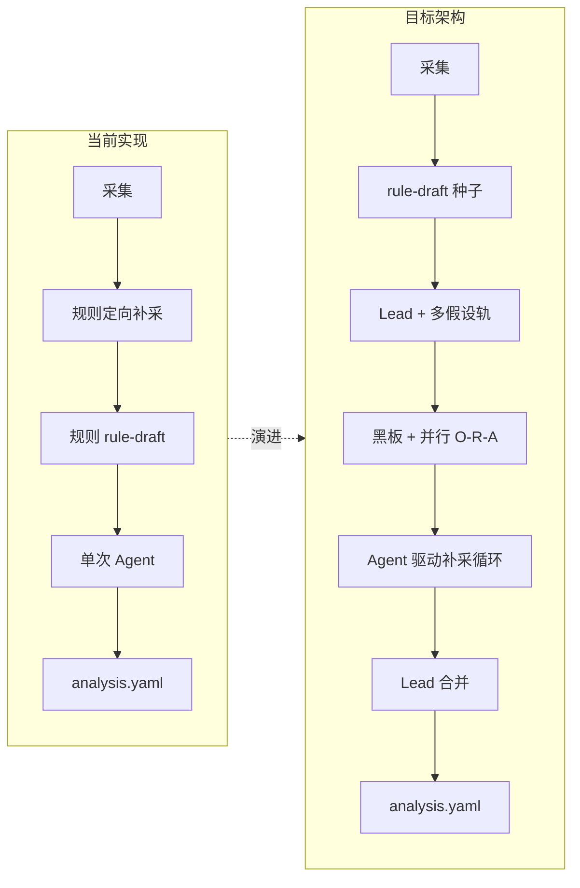

# 第 4 段目标流程架构（对齐稿）

本稿综合 **Datadog Bits**（假设树 + 并行验证 + Agent Trace）、**AWS DevOps Agent**（竞争假设 + 正反证 + Investigation Journal）与 **midstack 设想**（多假设分轨、共享互补、只读补采），画出建议对齐的**目标架构**。

**用途：** 评审流程与边界，**不代表当前已实现**。

**概念展开图：** [④ 推理验证](../../concepts/diagrams/supplements/architecture-phase4-detail.png)（见 [architecture-overview.md](../../concepts/architecture-overview.md)）

---

## 1. 总览：五段中的位置

**对齐点：**

| 外部概念 | 本架构落点 |
|----------|------------|
| Datadog hypothesis tree | 假设轨 + 黑板上的父子/分支关系 |
| Datadog Agent Trace | `reasoning-board` 步骤日志 + 可选 trace artifact |
| AWS Investigation Journal | `reasoning-board` 不可变追加式记录 |
| AWS Topology Graph | 第 3 段 `structured_record` + `signal_bundle` 对象关联 |
| midstack 定向补采 | Evidence Loop 内只读白名单补采，仍属单次 `/analyse` |

---

## 2. 第 4 段内部：O-R-A × 假设分轨（核心）

这是与 Datadog / AWS **最接近**的目标执行模型。

### 单条假设轨内的 O-R-A 微循环

（对应 Datadog「每条分支上的 observation-reasoning-action」）

**轨间「信息共享、互补」的具体含义：**

| 机制 | 作用 | 示例 |
|------|------|------|
| `shared_findings` | 避免重复采集/重复推理 | H2 已查过 CoreDNS，H1 不再重复 |
| `cross_hypothesis_notes` | 跨轨反证 | H1「DNS 故障」被 H3「overlay 分区」的反证削弱 |
| `journal_steps` | 审计轨迹（AWS Journal） | 每步 tool/推理/补采可追溯 |
| Lead 仲裁 | 解决冲突解读 | 同一日志两轨解读相反 → 结论降级 |

---

## 3. Evidence Loop：与假设轨的衔接

（midstack 已收敛：单次 analyse、最多 1 轮、只读白名单）

---

## 4. 与 Datadog / AWS 的对照映射

---

## 5. 深入分支（可选，非默认路径）

**与段名关系：** 「深入验证」在架构上 = 默认假设验证（上节 O-R-A）+ 本图条件分支；MVP 可先只实现前者。

---

## 6. 运行时角色与 artifact（实现视角）

| Artifact | 职责 | 类比 |
|----------|------|------|
| `reasoning-board.yaml` | 调查过程态：findings、journal、跨轨反证 | AWS Journal + Datadog Agent Trace |
| `analysis.yaml` | 调查终态：hypotheses 终局 + conclusion | Datadog Investigation 结论视图 |
| `agent-reasoning-task.md` | Lead 与轨的合同 | 编排指令 |

---

## 7. 与当前实现的差异（评审用）

| # | 差异项 | 当前 | 目标 |
|---|--------|------|------|
| 1 | 假设执行 | 单 Agent 一次写完 | Lead + 2–3 并行假设轨 |
| 2 | 过程记录 | 无独立过程 artifact | `reasoning-board.yaml` |
| 3 | 轨间关系 | 仅在终稿 hypotheses 并列 | 黑板实时 cross-refute |
| 4 | 补采触发 | 规则先于 Agent | Agent/Lead 基于 gap 触发，仍 1 轮上限 |
| 5 | 深入分支 | 合同提及，无自动触发 | 条件门禁 + next_actions |

---

## 8. 建议评审问题

对齐本架构前，建议确认：

1. **假设轨数量上限：** 2 轨、3 轨，还是动态 2–5？
2. **黑板是否落盘：** 第一版要不要 `reasoning-board.yaml`，还是只在 Lead 上下文？
3. **补采顺序：** 是否接受「规则预补采（快路径）+ Agent 触发的第二轮（仍共 1 轮上限）」？
4. **深入分支：** MVP 是否只做合同/next_actions，不自动进入代码分析？
5. **Phase 5 边界：** Lead 合并时是否同时写 `knowledge_candidates`，还是拆分第二次调用？

---

## 9. 一句话定义（对齐用）

> **第 4 段 = 在共享证据上下文上，Lead 维护竞争假设组合，多条假设轨并行执行 O-R-A 微循环并通过推理黑板交换发现与反证；必要时经门禁触发一轮只读定向补采；最终由 Lead 仲裁产出受结论 ceiling 约束的 `analysis.yaml`。**
