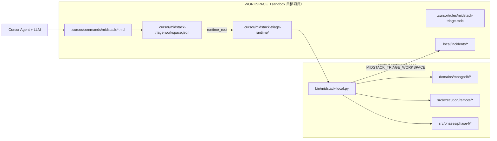

# Spec: Sandbox 最小依赖画像（使用者视角）

## Objective

**我们在回答什么**

作为「使用人」，`midstack-sandbox`（或任意通过 `plugin-install.py --workspace-init` 初始化的目标项目）实际依赖哪些组件？安装后哪些内容必须随包携带，哪些是使用者自备的 Agent/LLM、主机工具和远程环境？

**用户故事**

- 作为测试/试用者，我想在一个独立目录里跑 `/midstack:start` -> `/midstack:analyse`，而不必理解整个 monorepo 布局。
- 作为分发方，我想确认安装态不会隐式依赖开发者本机的 `midstack-triage` 源码路径。
- 作为维护者，我想用门禁提前发现 Cursor/Claude 命令又回退到源码 checkout 的问题。

**成功画像**

使用者拿到一个安装好的 workspace 后：

1. 用 Cursor（或等价 Agent 宿主）打开该目录。
2. **离线**：可对 workspace-local fixture/input 跑通 analyse。
3. **在线**（可选）：提供 SSH/K8s 凭据后可跑 live 采集与分析。
4. 除 Agent/LLM、Python 依赖与（在线时的）远程环境外，不依赖开发者本机的 `midstack-triage` 源码路径。

---

## ASSUMPTIONS I'M MAKING

1. 「使用人」= 通过 Cursor 插件路径使用 Midstack 的工程师，不是贡献 `midstack-triage` 源码的维护者。
2. 「sandbox」= `plugins/cursor/test-sandbox.py` 创建/维护的目标项目（当前默认 `/home/stephen/AI/midstack-sandbox`），或任何 `--workspace-init` 安装目标。
3. 在线排障仍需要可 SSH 的跳板机 + 远端 `kubectl` + 目标 MongoDB 集群。这是业务依赖，无法从脚本包里消除。
4. 源码仓库仍用于开发、打包、升级、验证；但不能是安装后 `/midstack:*` 的运行依赖。

---

## Tech Stack

| 层级 | 组件 | 是否可省略 |
|------|------|------------|
| Agent 宿主 | Cursor IDE + Cursor Agent（或 `agent` CLI） | 插件 UX 不可省略；纯 CLI 可直调 workspace runtime |
| 安装态 runtime | `.cursor/midstack-triage-runtime/` 中的 `src/`、`tools/plugin/`、`domains/`、`scenarios/` 等 | 不可省略 |
| 语言 | Python 3.10+ | 不可省略 |
| Python 包 | PyYAML（`import yaml`） | 不可省略 |
| 本地工具（live） | `sshpass` | 仅 live 采集 |
| 远程环境（live） | SSH 跳板、远端 `kubectl`、Pod `exec` 权限、Pod 内 `mongosh`/`mongo` | 仅 live 采集 |
| LLM | 用户自备（Cursor 内置模型或 API） | Agent 推理阶段需要 |

---

## 当前架构：Workspace-Local Runtime

Sandbox 是安装态 workspace。Cursor 适配器会把命令、规则和运行时 payload 都投影到该 workspace 内，Agent 从 workspace state 读取 `runtime_root` 后执行本地 payload。



**关键代码行为**

- `plugin-install.py --workspace-init`：写入 `.cursor/midstack-triage.workspace.json`，复制 `.cursor/commands/midstack:*.md` 与 `.cursor/rules/midstack-triage.mdc`，并复制 runtime payload 到 `.cursor/midstack-triage-runtime/`。
- Plugin commands：Agent 执行 `python3 <runtime_root>/bin/midstack-local.py <subcommand> ...`。
- `MIDSTACK_TRIAGE_WORKSPACE`：解析输入/输出相对路径（如 `.local/incidents`）。
- runtime payload：从自身目录读取 `domains/`、`scenarios/`、`src/`、`core/`，不回到源码 checkout。

因此：只要 workspace 内 runtime payload 完整，`/midstack:start`、`/midstack:analyse`、`/midstack:review` 不需要访问 `/home/stephen/AI/midstack-triage`。

---

## Commands

### 维护者：创建/验证 sandbox

```bash
python3 plugins/cursor/plugin-install.py --upgrade --workspace-init /home/stephen/AI/midstack-sandbox
python3 plugins/cursor/plugin-install.py --check-workspace /home/stephen/AI/midstack-sandbox
python3 plugins/cursor/test-agent-cli.py
python3 plugins/cursor/test-sandbox.py /home/stephen/AI/midstack-sandbox
```

### 使用者：Cursor 插件主路径

在 Cursor 中打开 sandbox 工作区后：

```text
/midstack:start  <自然语言：IP、账号密码、故障线索>
/midstack:analyse
/midstack:review
/midstack:validate
```

### 使用者：绕过 Cursor 的 CLI 等价

```bash
export MIDSTACK_TRIAGE_WORKSPACE=/home/stephen/AI/midstack-sandbox
python3 /home/stephen/AI/midstack-sandbox/.cursor/midstack-triage-runtime/bin/midstack-local.py analyse \
  --output-root .local/incidents
```

### 依赖自检（live）

```bash
which python3 sshpass
python3 -c "import yaml"
# 远程由 executor 在 start 阶段检查：kubectl、exec 权限、mongosh 等
```

---

## Project Structure

### 安装后 sandbox 实际拥有的

```text
my-sandbox/
  .cursor/
    midstack-triage.workspace.json   # runtime_root + plugin_version
    commands/midstack:*.md           # copied command files
    rules/midstack-triage.mdc        # copied rule file
    midstack-triage-runtime/
      bin/midstack-local.py
      bin/validate-repo.py
      tools/plugin/
      tools/support/
      tools/validators/
      src/
      domains/
      scenarios/
      core/
  .local/
    incidents/            # 运行时产出（gitignore）
  .gitignore              # 含 .local/
  README.md
```

Plugin（用户级 symlink，不在 sandbox 内）：

```text
~/.cursor/plugins/local/midstack-triage/   # -> midstack-triage/plugins/cursor/
  .cursor-plugin/plugin.json
  commands/midstack:*.md
  rules/midstack-triage.mdc
```

源码仓库只在安装/升级/验证时使用：

```text
midstack-triage/
  plugins/cursor/plugin-install.py
  plugins/cursor/test-agent-cli.py
  plugins/cursor/test-sandbox.py
  tests/fixtures/         # 维护者 smoke 输入，测试时复制到 workspace .local/
```

### 两类「Skill」（易混淆）

| 类型 | 路径 | 谁消费 | 是否装入 sandbox runtime |
|------|------|--------|--------------------------|
| Cursor Agent Skills | `midstack-triage/.cursor/skills/*` | Cursor Agent 通用行为（如 spec-driven-development） | 否；与 Midstack 插件无硬依赖 |
| 领域 Triage Skills | `domains/mongodb/skills/*/metadata.yaml` | `midstack-local.py` / `skill_resolver.py` 路由脚本与 runbook | 是，随 `domains/` 进入 runtime payload |

---

## Boundaries

Always:

- Cursor 安装态命令读取 `runtime_root`。
- Cursor 安装态命令从 `.cursor/midstack-triage-runtime/bin/` 执行。
- Smoke 测试 cwd 使用 workspace，不能借源码 cwd 通过。
- Runtime payload 必须包含 `src/`、`domains/`、`scenarios/`、`core/` 和必要的 thin tools entrypoint。

Never:

- 在 Cursor 命令或规则里读取 `engine_root`。
- 在 Cursor 命令或规则里生成 `cd /path/to/midstack-triage && python3 tools/plugin/midstack-local.py ...`。
- 把 sandbox `.cursor/`、`.claude/`、`.local/` 投影提交到源码仓库。
- 把源码 fixture 绝对路径作为用户安装态命令示例。

Ask first:

- 改变 slash command 名称。
- 改变 runtime payload 目录布局。
- 把 repository-only 验证工具移动到用户安装态命令面。

---

## Success Criteria

1. `.cursor/midstack-triage.workspace.json` 包含 `runtime_root`，不包含 `engine_root`。
2. `.cursor/commands/midstack:*.md` 和 `.cursor/rules/midstack-triage.mdc` 是 workspace-local copy，不是 symlink。
3. 命令模板、规则、workspace 投影均不包含源码仓库执行模式。
4. `python3 plugins/cursor/test-agent-cli.py` 通过。
5. `python3 plugins/cursor/test-sandbox.py /home/stephen/AI/midstack-sandbox` 通过。
6. 手工或等价命令运行 `/midstack:analyse` 时，shell 命令形态为 `python3 <workspace>/.cursor/midstack-triage-runtime/bin/midstack-local.py analyse ...`。
