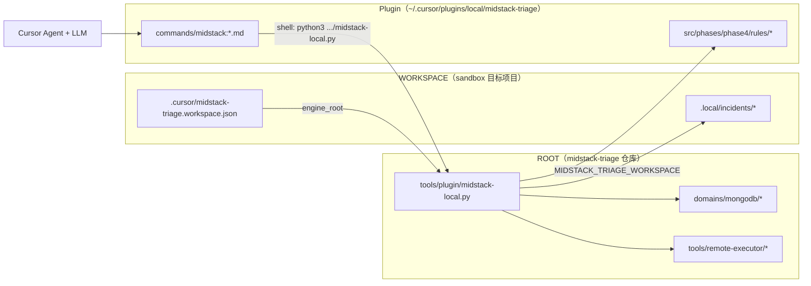

# Spec: Sandbox 最小依赖画像（使用者视角）

## Objective

**我们在回答什么**

作为「使用人」，`midstack-cursor-sandbox`（或任意通过 `plugin-install.py --workspace-init` 初始化的目标项目）实际依赖哪些组件？如何把它收敛到「只需拷贝/下载 skills、脚本等资产 + 自备 Agent/LLM」？

**用户故事**

- 作为测试/试用者，我想在一个独立目录里跑 `/midstack:start` → `/midstack:analyse`，而不必理解整个 monorepo 布局。
- 作为分发方，我想明确哪些是必须随包携带的，哪些是使用者自备的（Agent、LLM、可选的 K8s 环境）。

**成功画像（目标态，尚未实现）**

使用者拿到一个 **可移植包** 后：

1. 解压到任意目录，运行一条安装命令。
2. 用 Cursor（或等价 Agent 宿主）打开该目录。
3. **离线**：可对 fixture 跑通 `midstack_analyse_fixture`。
4. **在线**（可选）：提供 SSH/K8s 凭据后可跑 live 采集与分析。
5. 除 Agent/LLM 与（在线时的）远程环境外，**不隐式依赖** 开发者本机的 `midstack-triage` 源码路径。

---

## ASSUMPTIONS I'M MAKING

1. 「使用人」= 通过 Cursor 插件路径使用 Midstack 的工程师，不是贡献 `midstack-triage` 源码的维护者。
2. 「sandbox」= `plugins/cursor/test-sandbox.py` 创建/维护的目标项目（当前默认 `/home/stephen/AI/midstack-cursor-sandbox`），或任何 `--target-dir` 安装目标。
3. 「skills」可能指两类资产，本 spec 会分开说明（见下文 §3）。
4. 最小依赖的目标是 **分发形态**，不是立刻改代码；当前实现的真实依赖以 §2 为准。
5. 在线排障仍需要可 SSH 的跳板机 + 远端 `kubectl` + 目标 MongoDB 集群——这是业务依赖，无法从「脚本包」里消除。

→ 若以上假设有误，请在进入 Plan 阶段前纠正。

---

## Tech Stack

| 层级 | 组件 | 是否可省略 |
|------|------|------------|
| Agent 宿主 | Cursor IDE + Cursor Agent（或 `agent` CLI） | 插件 UX 不可省略；纯 CLI 可直调 `midstack-local.py` |
| 运行时引擎 | `midstack-triage` 仓库中的 `tools/`、`domains/`、`scenarios/` | **当前不可省略**（见 §2.1） |
| 语言 | Python 3.10+ | 不可省略 |
| Python 包 | PyYAML（`import yaml`） | 不可省略 |
| 本地工具（live） | `sshpass` | 仅 live 采集 |
| 远程环境（live） | SSH 跳板、远端 `kubectl`、Pod `exec` 权限、Pod 内 `mongosh`/`mongo` | 仅 live 采集 |
| LLM | 用户自备（Cursor 内置模型或 API） | Agent 推理阶段需要 |

---

## 当前架构：双根（Two-Root）+ agent-cli Plugin

Sandbox **不是** 自包含运行时。它是 **薄工作区（workspace）**；引擎始终在 **midstack-triage 源码根（ROOT）** 执行。Cursor 通过 **官方 Plugin**（commands/rules）让 Agent 用 shell 调用 `midstack-local.py`。



**关键代码行为**

- `plugin-install.py --workspace-init`：写入 `.cursor/midstack-triage.workspace.json`；将 `.cursor/commands/midstack:*.md` 与 `.cursor/rules/midstack-triage.mdc` **symlink** 到插件源文件（供 slash 命令展开）。
- Plugin commands：Agent 执行 `python3 <engine_root>/tools/plugin/midstack-local.py <subcommand> ...`。
- `MIDSTACK_TRIAGE_WORKSPACE`：解析 **输出/输入相对路径**（如 `.local/incidents`）；不切换脚本查找根。
- `skill_resolver.py`：skills/scripts/runbooks 一律从 `ROOT/domains/...` 读取。

因此：换机器或只拷贝 sandbox 目录 **不够**；必须仍有可访问的 `midstack-triage` 克隆（或由 `engine_root` 指向的等价路径）。

---

## Commands

### 维护者：创建/验证 sandbox

```bash
# 在 midstack-triage 仓库内
python3 plugins/cursor/test-sandbox.py
# 或指定目标目录
python3 plugins/cursor/test-sandbox.py /path/to/my-sandbox
```

等价步骤：

```bash
python3 plugins/cursor/plugin-install.py --upgrade --workspace-init /path/to/my-sandbox
python3 plugins/cursor/plugin-install.py --check-workspace /path/to/my-sandbox
python3 plugins/cursor/test-agent-cli.py
```

### 使用者：插件主路径

在 Cursor 中打开 sandbox 工作区后：

```text
/midstack:start  <自然语言：IP、账号密码、故障线索>
/midstack:analyse
/midstack:review
/midstack:validate
```

### 使用者：绕过 Cursor 的 CLI 等价（仍依赖 ROOT）

```bash
export MIDSTACK_TRIAGE_WORKSPACE=/path/to/my-sandbox

# 离线 fixture 分析
python3 tools/plugin/midstack-local.py analyse-fixture \
  --input-dir tests/fixtures/mongodb/kubernetes-scheduling-failure-sample \
  --output-dir /path/to/my-sandbox/.local/incidents/offline-test

# 工程校验（在 ROOT 执行）
python3 tools/validators/validate-repo.py
```

### 依赖自检（live）

```bash
which python3 sshpass
python3 -c "import yaml"
# 远程由 executor 在 start 阶段检查：kubectl、exec 权限、mongosh 等
```

---

## Project Structure

### 安装后 sandbox 实际拥有的

```text
my-sandbox/
  .cursor/
    midstack-triage.workspace.json   # engine_root + plugin_version
    commands/midstack:*.md           # symlink → plugin/commands/
    rules/midstack-triage.mdc        # symlink → plugin/rules/
  .local/
    incidents/            # 运行时产出（gitignore）
  .gitignore              # 含 .local/
  README.md
```

Plugin（用户级 symlink，不在 sandbox 内）：

```text
~/.cursor/plugins/local/midstack-triage/   # → midstack-triage/plugins/cursor/
  .cursor-plugin/plugin.json
  commands/midstack:*.md
  rules/midstack-triage.mdc
```

### 运行时仍从 ROOT 读取（未安装到 sandbox）

```text
midstack-triage/
  tools/
    plugin/midstack-local.py
    remote-executor/mongodb-executor.py
    src/phases/phase4/rules/mongodb.py
    lib/skill_resolver.py
    validators/validate-repo.py
  domains/mongodb/
    scripts/              # 采集脚本 + manifest
    skills/               # 领域 skill（metadata.yaml + skill.md）
    runbooks/
    commands/
  scenarios/
  tests/fixtures/         # 离线 replay 输入
```

### 两类「Skill」（易混淆）

| 类型 | 路径 | 谁消费 | 是否装入 sandbox |
|------|------|--------|------------------|
| **Cursor Agent Skills** | `midstack-triage/.cursor/skills/*` | Cursor Agent 通用行为（如 spec-driven-development） | **否**；与 Midstack 插件无硬依赖 |
| **领域 Triage Skills** | `domains/mongodb/skills/*/metadata.yaml` | `midstack-local.py` / `skill_resolver.py` 路由脚本与 runbook | **否**；运行时从 ROOT 读 |

使用者若只说「拷贝 skills」，需明确是 Cursor 侧还是 `domains/` 侧；**当前插件路径主要依赖后者 + 全部 `domains/.../scripts`**。

---

## 依赖分层（使用者清单）

### Tier 0 — 永远需要（认知/推理）

| 依赖 | 用途 | 可替代 |
|------|------|--------|
| Agent + LLM | 读 `agent-reasoning-task.md`，写 `analysis.yaml` / `report.md`，调 `finalize-analysis` | 可用其他 Agent 宿主，但需等价 shell/CLI 调用 |

规则层（`midstack-triage.mdc`）要求：**analyse 成功后 Agent 必须做推理收尾**，不能仅靠 `analysis.rule-draft.yaml`。

### Tier 1 — Cursor 插件 UX

| 依赖 | 用途 |
|------|------|
| Cursor | Plugin 宿主、`/midstack:*` 命令 |
| `agent` CLI | `plugin-install.py`、`test-sandbox.py` / `test-agent-cli.py` 校验 |
| `plugins/cursor/*` | Plugin manifest、commands、rules、`plugin-install.py` |

**可精简方向**：提供「无 Cursor」CLI-only 文档；允许用户只跑 `midstack-local.py`。

### Tier 2 — 引擎包（当前最大隐性依赖）

| 依赖 | 用途 |
|------|------|
| 完整 `midstack-triage` 克隆 | 所有 Python 编排、领域资产、fixture |
| Python 3 + PyYAML | 全链路 |

**这是与「只拷贝 sandbox」目标的主要差距。**

### Tier 3 — Live 采集（仅 `/midstack:start` + 远程 analyse）

| 依赖 | 位置 | 说明 |
|------|------|------|
| `sshpass` | 使用者本机 | `mongodb-executor.py` 硬检查 |
| SSH 账号/密码/端口 | 用户输入 → `remote-config.yaml` | 存在 sandbox `.local/` |
| 远端 `kubectl` | 跳板机 | 采集 K8s API、exec |
| `kubectl exec` 权限 | 集群 RBAC | rs.status、getShardMap 等 |
| Pod 内 `mongosh`/`mongo` | 目标 Pod | 由运行时探测，非本机安装 |
| 可达的 MongoDB K8s 集群 | 客户环境 | 业务依赖 |

### Tier 4 — 工程/CI（维护者，非终端用户）

| 依赖 | 用途 |
|------|------|
| `validate-repo.py` + `tests/` | `/midstack:validate`、replay、score gate |
| `plugins/cursor/test-sandbox.py` | 集成冒烟 |

---

## 运行模式与最小依赖对照

| 模式 | 入口 | 必需依赖 | 不需要 |
|------|------|----------|--------|
| **A. Fixture 离线分析** | `/midstack:analyse` → `analyse-fixture` | ROOT 引擎 + Python + PyYAML + workspace 写权限 | SSH、集群、sshpass |
| **B. 已有 remote-run 回放** | `/midstack:analyse` → `analyse-remote-run` | 同 A + 已采集目录 | 实时 SSH |
| **C. Live start + analyse** | `/midstack:start` → `/midstack:analyse` | A + Tier 3 全部 + Agent | — |
| **D. 工程自检** | `/midstack:validate` | 完整 git 仓库 + tests | — |

**test-sandbox.py 默认验证的是模式 A**（fixture → `agent-reasoning-task.md` 存在），不证明 live 集群可用。

---

## Code Style

本 spec 为文档资产；若后续实现「可移植包」，安装脚本应：

- 使用相对路径或 `MIDSTACK_TRIAGE_ROOT` 环境变量，避免写死 `/home/stephen/AI/midstack-triage`。
- 保持 `MIDSTACK_TRIAGE_WORKSPACE` 仅指向用户项目目录。

---

## Testing Strategy

| 级别 | 命令 | 证明什么 |
|------|------|----------|
| 安装检查 | `plugin-install.py --check-workspace` | workspace state 与 plugin 版本一致 |
| agent-cli 冒烟 | `test-agent-cli.py` / `test-sandbox.py` | shell 调用 + fixture analyse |
| 单元测试 | `python3 -m pytest tests/unit` | 引擎逻辑（在 ROOT） |
| Live 回归 | 用户对真实集群跑 start/analyse | Tier 3 依赖满足 |

**最小依赖验收（目标态，待实现）**：在 **仅含 portable 包 + sandbox 目录、无 sibling git 克隆** 的机器上，模式 A 通过 `test-sandbox.py`。

---

## Boundaries

- **Always**
  - 区分 WORKSPACE（产出）与 ROOT（引擎）并向使用者说明。
  - Live 模式明确列出 SSH/K8s/集群为外部依赖。
  - Agent 推理收尾为 analyse 完成定义的一部分（见 plugin rules）。

- **Ask first**
  - 将 ROOT 打包进用户目录（体积、升级策略）。
  - 去掉 `sshpass` 依赖（改 SSH 密钥方案）。
  - 让 sandbox 不依赖 Cursor（仅 CLI）。

- **Never**
  - 声称「只拷贝 sandbox 目录即可运行」——在当前实现下为假。
  - 把 `remote-config.yaml` 中的密码提交到 git。

---

## Success Criteria

### 文档阶段（本 spec）

- [ ] 使用者能对照 §3 分层判断自己需要哪一档依赖。
- [ ] 分清两类 skills 与 install 拷贝范围。
- [ ] 确认双根架构是现状而非目标。

### 目标态（后续 Plan/Implement）

- [ ] **Portable 包**：单目录或 tarball 含 `engine/`（现 ROOT 子集）+ `workspace/` 模板。
- [ ] `plugin-install.py` 支持 `--bundle-engine-into-target`（或独立 `package-portable.py`）。
- [ ] 新机器上模式 A 零配置通过（除 Python+PyYAML+Cursor）。
- [ ] 文档一页纸：**Bring your own** Agent/LLM；**Optional** cluster。

---

## Open Questions

1. **最小场景优先级**：只要 fixture 离线，还是必须 live 集群也算「最小」？→ 待定
2. ~~**是否必须 Cursor**~~ → **已确认：暂只支持 Cursor**
3. **分发形态**：官方 Plugin 本地 symlink（已采用）/ Team Marketplace / tarball？→ Portable 暂缓
4. **Cursor Agent Skills**（`.cursor/skills`）是否要随 portable 包分发，还是仅文档推荐？→ 待定
5. ~~**sshpass**~~ → **已确认：设计如此，不消除**

---


## 8. 已实现（agent-cli Plugin）

| 文件 | 作用 |
|------|------|
| `plugins/cursor/.cursor-plugin/plugin.json` | 官方 manifest |
| `plugins/cursor/plugin-install.py` | `--upgrade` / `--workspace-init` / `--check-workspace` |
| `plugins/cursor/cli_smoke.py` | 共享 agent-cli 冒烟辅助 |
| `plugins/cursor/test-agent-cli.py` | 默认 CI 冒烟 |
| `plugins/cursor/test-sandbox.py` | 固定 sandbox 路径冒烟 |
| `.cursor/midstack-triage.workspace.json` | 工作区 `engine_root` + `plugin_version` |

**评审结论（2026-06-12）**

- [x] 官方 Plugin 本地安装（symlink `plugins/cursor/`）
- [x] 不上传 Cursor Marketplace
- [x] agent-cli + shell 为唯一集成路径
- [x] CI 最小门禁：`test-agent-cli.py` + `test-plugin-manifest.py`
- [x] Cursor Agent Skills 不捆绑
- [ ] Portable `midstack-engine/` 捆绑 — 暂缓

**升级合同**：

```bash
python3 plugins/cursor/plugin-install.py --upgrade --workspace-init <workspace>
```

自动：刷新 symlink、更新 workspace state。`validate-repo` 默认跑 `test-agent-cli.py`。

---

## 与现有 spec 的关系

- 命令行为、状态机：仍以 [plugin-runtime.spec.md](plugin-runtime.spec.md) 为准。
- 用户可见命令：仍以 [plugin-usage.spec.md](plugin-usage.spec.md) 为准。
- 本文件补充：**sandbox 作为使用者项目的依赖拓扑与最小化路线图**。
- **Phase 2 计划**：§9；评审通过后更新 `status` 并进入 Phase 3 Tasks。
